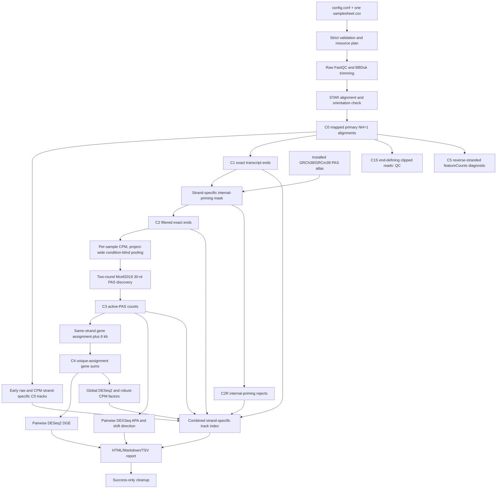

# rna_ends2tracks

`rna_ends2tracks` is a config-driven workflow for Lexogen QuantSeq REV V2 single-end data without UMIs. It performs gene-expression analysis, Mcell2019-style polyadenylation-site discovery and APA testing, creates strand-specific browser tracks, and supports GRCh38 and GRCm39—even in one samplesheet, with each genome analyzed independently.

The normal interface deliberately resembles `ATACseq2tracks`:

```bash
rna-ends2tracks /path/to/project/config/config.conf
```

Each project has only two input-configuration files:

```text
config/
├── config.conf
└── samplesheet.csv
```

YAML files from alpha.5 remain only as migration/reference material; normal alpha.6 runs use `config.conf`.

## Data flow



## Scientific contract

- QuantSeq REV V2, Read 1, single-end; UMIs are unsupported.
- Duplicate-flagged reads are retained. Coordinate deduplication is not performed.
- Statistical alignments are mapped, primary and `NH=1`; secondary, supplementary and multimapping records are reported and excluded.
- A clip at the cleavage-defining read end is separated into C1S rather than assigned an exact nucleotide.
- Internal priming is masked at ≥6 consecutive A/T bases or ≥7 A/T bases in a 10-nt window, then conservatively rescued around GENCODE transcript ends and the installed PAS atlas.
- Discovery uses sample-level C2 CPM, summed condition-blind within a genome, strict `30-nt window sum > 30`, two merge/recenter rounds, and lowest-coordinate tie-breaking.
- A summit at BED position `[p,p+1)` receives the 30-nt interval `[p-14,p+16)` (clipped only at chromosome boundaries).
- Ambiguous multi-gene PAS remain in catalogs/tracks but are excluded from C4 and APA statistics.
- Intragenic intronic and non-terminal-exonic PAS are retained as candidate premature cleavage/polyadenylation events.
- C4 active-PAS gene sums are primary DGE. C5 featureCounts values are diagnostic only.

The `C` labels mean workflow-specific **count universes**, not standard RNA-seq terms. C1S and C2R are side branches, while C5 is an independent diagnostic. See [C0-C5 data stages](docs/data_stages.md), [methods](docs/methods.md), [PAS atlases](docs/pas_atlases.md), and [limitations](docs/limitations.md).

## Quick start

1. Copy [config.conf](config/config.conf) and [samplesheet.csv](config/samplesheet.csv) into the project’s `config/` directory.
2. Set the project/output paths and the shared GRCh38 and/or GRCm39 reference paths.
3. Put every biological sample, technical library and lane in the same samplesheet.
4. Validate without executing tools:

```bash
rna-ends2tracks --stop-after validate config/config.conf
```

5. Review `00_metadata/resolved_config.tsv`, `contrasts.tsv`, `warnings.tsv`, and `resource_plan.tsv`.
6. Run:

```bash
rna-ends2tracks config/config.conf
```

The workflow writes one chronological master log inside the configured `OUTPUT_DIR`. Monitor it or request a concise snapshot from another shell:

```bash
tail -F /path/to/OUTPUT_DIR/rna_ends2tracks.log
rna-ends2tracks status config/config.conf
```

Detailed native-tool output remains under `OUTPUT_DIR/logs/`, and the latest machine-readable state is `OUTPUT_DIR/00_metadata/run_status.json`.
The status snapshot includes the workflow PID and whether it is still running, an ordered stage table, free disk space, and counts of contrasts, final BAMs, BigWigs, DGE/APA result tables, and reports. Use `--json` for the same observations in machine-readable form.

Useful controls:

```bash
rna-ends2tracks --dry-run config/config.conf
rna-ends2tracks --from-step exact_ends config/config.conf
rna-ends2tracks --stop-after alignment config/config.conf
rna-ends2tracks --force-step tracks config/config.conf
```

With the default `GENERATE_EARLY_C0_TRACKS=true`, raw and CPM all-read BigWigs are produced by the resumable `c0_tracks` stage immediately after alignment, before exact-end, DGE, and APA analysis. The later `tracks` stage reuses those outputs and generates only end-derived families; it does not repeat C0 strand extraction.

Matching receipts skip complete work. Small outputs use SHA-256 validation; large BAM/track outputs use size plus nanosecond mtime to keep resume checks fast after native tool validation. A lock under `.checkpoints/workflow.lock` prevents two processes from modifying the same output directory.

## Samplesheet model

Each row is one technical-library/lane FASTQ. Rows with the same `sample_id` are merged into one biological analysis unit. The biological metadata for those rows must be identical.

Required columns include:

- `sample_id`, `description`, `genome` (`GRCh38`/`GRCm39`);
- `biological_replicate_id`, `technical_replicate_id`, `lane_id`;
- `fastq_r1`; `fastq_r2` must be empty for the validated single-end profile;
- `condition`, `batch`, `subject`;
- `library_protocol`, `library_layout`, `read_length`, `kit_catalog`, `umi_present`.

`subject` defines paired biological units. For every condition pair, complete shared subjects use `~ subject + condition`; disjoint subjects use `~ condition`; partial/incomplete overlap fails by default. All eligible condition pairs with at least `MIN_REPLICATES_PER_CONDITION` are generated automatically. Cross-genome contrasts are never generated.

## Parallel execution

`MAX_TOTAL_THREADS` and `MAX_TOTAL_MEMORY_GB` are hard preflight ceilings. Stage controls include:

- `PREPROCESS_PARALLEL_JOBS` for FastQC/BBDuk lane jobs;
- `STAR_PARALLEL_JOBS × STAR_THREADS` for alignments;
- `SAMPLE_MERGE_PARALLEL_JOBS`;
- `END_EXTRACTION_PARALLEL_JOBS`;
- `DGE_CONTRAST_PARALLEL_JOBS` and `APA_CONTRAST_PARALLEL_JOBS`;
- `TRACK_PARALLEL_JOBS × TRACK_THREADS`.

The resolved maximum CPU/RAM for each pool is written before analysis. Outputs and timing fragments are deterministic even when jobs finish out of order.

Alpha.10 distinguishes executor types in `00_metadata/resource_plan.tsv`: external tools remain in bounded thread-managed subprocess pools, while CPU-bound Python exact-end workers use separate processes so `END_EXTRACTION_PARALLEL_JOBS` corresponds to usable CPU concurrency.

## Track families

| Family | Universe | Raw | CPM | DESeq2 | Robust CPM |
|---|---|---:|---:|---:|---:|
| aligned-read coverage | C0 blocks | yes | yes | no | no |
| exact transcript ends | C1 bases | yes | yes | no | no |
| filtered exact ends | C2 bases | yes | yes | yes | yes |
| internal-priming rejects | C2R bases | yes | yes, denominator C1 | no | no |
| active PAS | all C3 at summits | yes | yes (assigned-C3 denominator) | yes | yes |

Transcript-plus and transcript-minus BigWigs are separate; minus values are negative for browser display. BigWig is enabled by default; a bedGraph-only run requires retained bedGraphs explicitly. DESeq2 uses `1/size_factor`. Robust CPM uses `1e6/(size_factor × geometric_mean(C4 column sums))` and is checked numerically against `DESeq2::fpm(..., robust=TRUE)`. See [tracks and outputs](docs/tracks_and_outputs.md).

## Output layout

```text
results/
├── rna_ends2tracks.log        chronological stages and job outcomes
├── 00_metadata/
├── 01_qc/
├── 02_alignment/              C0 BAMs and orientation audit
├── 03_exact_ends/             C1, C1S, C2 and C2R
├── 04_active_pas/             pooled CPM, PAS catalog, C3 and C4
├── 05_gene_expression/        C4 DESeq2 and C5 diagnostics
├── 06_apa_a_mcell2019/        DEXSeq, shifts and differential PCPA
├── 07_apa_b/                  optional pilot-gated independent method
├── 08_apa_comparison/         optional independent-catalog concordance
├── 09_tracks/
├── 10_reports/
├── logs/
└── .checkpoints/              receipts, timings and run lock
```

`CLEANUP_INTERMEDIATES=true` is the default. Cleanup runs only after all enabled deliverable receipts and the report validate. It removes only an explicit allow-list (trimmed FASTQs, lane/all-alignment BAMs, temporary strand BAMs and bedGraphs), writes `provenance/cleanup/cleanup_manifest.tsv`, and preserves final BAMs, count universes, statistics, BigWigs, reports and provenance.

## Installation

Production releases are installed side-by-side. Installing a new environment does not modify a running older release; promotion changes one stable symlink atomically after tests pass.

```bash
bash scripts/bash/install_release.sh --tag v0.1.0-alpha.10
```

See [server installation](docs/server_installation.md) and [recovery/troubleshooting](docs/recovery_and_troubleshooting.md).

## APA-B status

APA-B remains disabled and pilot-gated. Enabling it requires an independently installed, pinned adapter command plus explicit `APA_B_PILOT_ACCEPTED=true`. APA-A and APA-B catalogs are never merged; comparison is a separate proximity/effect-concordance output.
