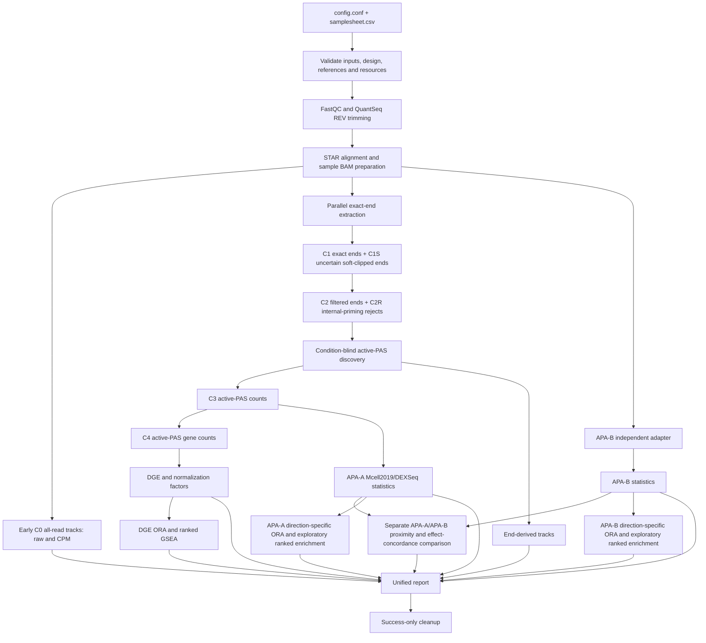

# rna_ends2tracks alpha.10 development plan

**Status:** implementation started on `feature/alpha10-development`; server alpha.9 remains untouched
**Prepared:** 2026-08-27
**Baseline:** `v0.1.0-alpha.9` (`0.1.0a9`)
**Primary interface:** one `config.conf` plus one `samplesheet.csv`

### Implementation checkpoint: 2026-08-27

The first laptop-only development slice is in progress and does not alter the active alpha.9 server run:

- a chronological `OUTPUT_DIR/rna_ends2tracks.log` and atomic `00_metadata/run_status.json`;
- `rna-ends2tracks status CONFIG_OR_OUTPUT_DIR`;
- stage and native-command lifecycle messages with links to detailed logs;
- a process-based scheduler for CPU-bound per-sample exact-end extraction and mixed Python/native track generation;
- parent-process progress events and per-worker timing/PID records;
- cross-process-safe event, master-log, and atomic status updates;
- a resumable post-alignment `c0_tracks` stage with separate C0/end receipts and no repeated C0 strand extraction per normalization;
- a richer status snapshot with workflow PID state, ordered stages, disk availability, and principal output counts;
- a beginner-facing C0-C5 data-stage glossary.

The Python 3.10/3.11, shell/R parsing, repository-contract, and complete Linux Conda-environment checks pass on the feature branch. These remain unreleased development changes. No stable launcher, installed environment, PAS atlas, active project configuration, or current output directory is modified by this work.

## 1. Executive decision

Alpha.10 should be a focused performance, observability, APA-B activation, biological-interpretation, reporting, and usability release. It should preserve the validated alpha.9 scientific contracts while making the workflow substantially faster and easier to operate.

The recommended release boundary is:

1. repair CPU-bound parallel execution, especially exact-end extraction;
2. provide one chronological master log and a simple status command;
3. publish raw and CPM all-read tracks immediately after alignment;
4. turn APA-B from an adapter placeholder into an installable, independently validated pilot implementation;
5. replace the fragmented documentation with a numbered beginner-to-advanced guide comparable in organization to `ATACseq2tracks`;
6. make reference handling species-extensible, but do **not** advertise zebrafish or *C. elegans* as production-supported in alpha.10;
7. add reproducible, contrast-specific enrichment for DGE, APA-A, and—when enabled—APA-B, using analysis-specific gene universes;
8. replace the basic module-status report with one comprehensive scientific HTML report summarizing every enabled DGE and APA result variant.

Zebrafish and *C. elegans* should be validated in a subsequent release. Adding their names to configuration validation without organism-specific reference, PAS-atlas, orientation, and real-data testing would create nominal rather than genuine support.

## 2. Evidence from alpha.9

The current 18-sample mouse run provides a useful real-server benchmark.

| Observation | Interpretation | Alpha.10 response |
|---|---|---|
| Eighteen STAR jobs completed successfully with 73.35–84.41% unique mapping | Alignment concurrency is functioning | Preserve the current bounded external-process model |
| STAR processed approximately 532 million reads in about 24 minutes | Eight concurrent STAR jobs using 12 threads each can use the server effectively | Keep configurable STAR job and thread controls |
| Exact-end extraction used only approximately two CPU cores despite `END_EXTRACTION_PARALLEL_JOBS=12` | CPU-bound Python work is scheduled in a `ThreadPoolExecutor` and is constrained by Python execution | Replace thread workers with real processes |
| Progress had to be inferred from a nohup log, `events.jsonl`, process inspection, and output files | Logging is technically present but operationally fragmented | Add one authoritative master log and `status` command |
| Raw strand-specific all-read BigWigs are generated only in the late `tracks` stage | A useful early deliverable is unnecessarily blocked by APA and DGE | Split early C0 tracks from end-derived tracks |
| APA-B is disabled and requires an externally supplied command template | The comparison framework exists, but the alternative method is not operational out of the box | Supply a pinned adapter installation and acceptance workflow |
| Documentation describes many individual contracts but lacks a clear learning path | The content is fragmented and assumes substantial prior knowledge | Rebuild documentation around numbered user journeys |
| Alpha.9 produces DGE and APA tables but no pathway/gene-set interpretation | Biological interpretation stops at individual genes and PAS | Add independent DGE and APA enrichment modules |
| `10_reports/report.html` contains basic project/module information but does not summarize STAR metrics, DGE, APA shifts, PCPA, comparison, or enrichment | The final report is not a scientific results report | Build a complete contrast- and method-level report |

Alpha.9 outputs remain scientifically usable. These findings primarily affect speed, progress visibility, accessibility of early tracks, and completeness of the second APA method.

## 3. Design principles

Alpha.10 should follow these rules:

- Preserve `config.conf` and `samplesheet.csv` as the only per-project input documents.
- Preserve independent biological samples and explicit biological/technical replicate hierarchy.
- Preserve automatic contrast-specific paired versus unpaired statistical designs.
- Preserve the unique-primary, duplicate-retaining C0 count universe unless a versioned method review explicitly approves a change.
- Preserve C1, C1S, C2, C2R, C3, and C4 count invariants.
- Preserve condition-blind, project-wide active-PAS discovery.
- Preserve independent APA-A and APA-B catalogues; never merge one method into the other.
- Preserve separate DGE, APA-A, and APA-B enrichment inputs, scores, foregrounds, and tested-gene backgrounds.
- Treat pathway enrichment as downstream interpretation, not as evidence that changes in RNA abundance and PAS usage are the same biological effect.
- Preserve immutable, versioned shared installations and success-only cleanup.
- Prefer simple commands and sensible defaults; advanced controls should remain available without burdening first-time users.
- Do not introduce Nextflow in alpha.10.

## 4. Proposed alpha.10 workflow graph



The graph is a dependency graph, not a requirement to execute every downstream branch serially. Once alignment is complete, early tracks, exact-end extraction, and APA-B preparation may run independently within the global resource budget.

## 5. Workstream A — correct and improve parallel execution

### 5.1 Replace Python thread workers for CPU-bound exact-end extraction

Current `run_bounded()` always uses `ThreadPoolExecutor`. This is appropriate for workers that mainly wait for external programs, but not for Python-heavy BAM parsing, coordinate extraction, internal-priming evaluation, and table generation.

Implement:

- a process-based bounded executor for `_extract_sample()`;
- serializable, top-level worker inputs rather than closures;
- one worker process per sample, limited by `END_EXTRACTION_PARALLEL_JOBS`;
- parent-process collection of results, failures, timings, and progress messages;
- clean termination of remaining workers after an unrecoverable failure;
- deterministic output order independent of job-completion order;
- per-worker temporary directories and atomic final-file publication.

Use the existing thread executor only for orchestration of external subprocesses such as FastQC, BBDuk, STAR, samtools, bedtools, and independent R commands.

### 5.2 Read the correct BAM once

The alpha.9 extractor prefers lane-level BAMs when they remain present. This can rescan more alignment records than needed and makes performance depend on cleanup state.

For the default unique-primary method:

- extract C1/C1S from the final C0 sample BAM;
- confirm that the final C0 BAM retains the required duplicate flags and CIGAR information;
- obtain STAR multimapping/unmapped audit metrics from STAR logs rather than rescanning rejected lane records;
- make exact-end results identical before and after cleanup;
- retain an optional diagnostic mode for a full lane-level mapping-class audit, disabled by default.

Acceptance requires exact agreement of eligible C1/C1S positions and counts between the reviewed alpha.9 method and the new default on human and mouse fixtures.

### 5.3 Optimize active-PAS discovery

The current implementation loads per-sample position dictionaries, pools them in memory, sorts the complete pooled signal, and processes each genome serially.

Implement in stages:

1. stream sorted C2 inputs using a deterministic multiway merge;
2. process chromosome and strand partitions independently;
3. bound the number of discovery workers separately from extraction workers;
4. reassemble partitions in reference chromosome order;
5. retain exact Mcell2019 window, local-maximum, tie-breaking, interval, and two-round behavior;
6. record peak counts and wall time per chromosome/strand.

If the streaming rewrite would delay alpha.10 excessively, process-based exact-end extraction remains the P0 requirement and streaming discovery becomes alpha.10.1.

### 5.4 Remove duplicated track work

The current track code recreates strand BAMs for every all-read normalization and writes non-BAM signal bedGraphs more than once inside the strand loop.

Implement:

- create each sample's transcript-plus and transcript-minus C0 strand representation once;
- generate one unscaled base coverage bedGraph per strand;
- derive raw and CPM outputs from that base signal without rereading the BAM;
- call `_write_signal_bedgraphs()` once per family/normalization, not once per strand;
- reuse C1/C2/C2R/C3 parsed rows across normalizations;
- delete temporary strand BAMs and bedGraphs only after all requested outputs validate;
- preserve negative values for transcript-minus browser display.

### 5.5 Improve resource controls

Current total-thread and memory settings are preflight ceilings, not operating-system enforcement.

Implement:

- document their exact meaning;
- introduce parent-managed CPU and memory tokens for concurrently running work units;
- prevent job submission when its declared resources would exceed the remaining budget;
- add `FEATURECOUNTS_THREADS` instead of deriving it from `SAMTOOLS_THREADS`;
- add `ACTIVE_PAS_PARALLEL_JOBS`;
- pass `APA_B_THREADS` to the APA-B adapter through a documented placeholder or environment variable;
- record requested and effective concurrency in the master log and run report;
- warn when storage throughput, number of samples, or available RAM reduces effective concurrency.

Do not automatically use all server CPUs. Defaults should remain safe for a shared server, while the user can deliberately raise them in `config.conf`.

### 5.6 Performance acceptance criteria

- Alpha.10 and alpha.9 produce identical reviewed count universes and statistical inputs on fixed fixtures.
- Four configured exact-end workers demonstrate more than two concurrently active worker processes.
- On a representative four-sample subset, exact-end extraction is at least three times faster with four workers than the alpha.9 thread implementation, unless a documented storage bottleneck prevents it.
- No stage exceeds the configured CPU or memory token budget.
- Parallel failures identify the stage, sample/contrast, command, log, and exit status.
- Re-running after interruption skips every output with a valid receipt.

## 6. Workstream B — one clear master log and live status

### 6.1 Canonical log

Every run should create one authoritative human-readable log without requiring shell redirection:

```text
OUTPUT_DIR/rna_ends2tracks.log
```

The console should show the same high-level messages. Existing per-tool logs and `logs/events.jsonl` should remain for diagnosis and machine parsing, but users should not need to follow them during a normal run.

### 6.2 Required master-log content

Each line should contain:

- ISO timestamp;
- severity (`INFO`, `WARNING`, or `ERROR`);
- ordered stage number and name;
- sample, lane, genome, or contrast identifier where relevant;
- lifecycle state: `START`, `RUNNING`, `DONE`, `SKIPPED`, `DISABLED`, or `FAILED`;
- completed/total work units;
- elapsed time and, after sufficient observations, a clearly labelled approximate ETA;
- command and process ID for external processes;
- effective thread and memory allocation;
- location of the detailed per-tool log.

Example:

```text
2026-08-27T06:10:15Z INFO [03 exact_ends] START 18 samples; workers=8; memory=32/400 GB
2026-08-27T06:18:42Z INFO [03 exact_ends] DONE WAPL_IAA_R3 (7/18); elapsed=00:08:27
2026-08-27T06:18:42Z INFO [03 exact_ends] PROGRESS 7/18; stage_elapsed=00:08:27; ETA≈00:12:10
```

Parallel tool output must carry sample/job prefixes so that interleaved messages remain interpretable. Use a multiprocessing-safe logging queue with one parent writer rather than allowing workers to append concurrently without coordination.

### 6.3 Status command

Add:

```bash
rna-ends2tracks status /path/to/config/config.conf
```

It should report:

- workflow version and run PID;
- whether the PID is alive;
- current stage and current work units;
- completed, failed, skipped, and pending stages;
- elapsed time and approximate ETA when available;
- most recent warning/error;
- output directory, master-log path, and disk usage;
- counts of currently available BAMs, BigWigs, contrasts, and reports.

Also write an atomically updated `00_metadata/run_status.json` for scripts and reports.

### 6.4 Failure and completion behavior

- Write an explicit final `WORKFLOW COMPLETED` or `WORKFLOW FAILED` block.
- Include total elapsed time and a short output summary.
- On failure, print one next command for safe resumption.
- Record cleanup activity in the same master log.
- Preserve the first failure and all suppressed worker failures.

### 6.5 Logging acceptance criteria

- `tail -F OUTPUT_DIR/rna_ends2tracks.log` is sufficient to understand progress.
- Every enabled stage emits `START` and terminal `DONE`, `SKIPPED`, `DISABLED`, or `FAILED` messages.
- Every sample-level and contrast-level process emits start/finish messages.
- Messages appear promptly rather than only when buffers close.
- The master log is never used as a receipt and may be safely retained or copied.

## 7. Workstream C — produce useful tracks earlier

Raw and CPM-normalized all-read strand-specific BigWigs should be produced immediately after a sample's final C0 BAM validates. They do not depend on exact-end extraction, active-PAS discovery, DGE, or APA.

Implement two track phases:

1. **early C0 tracks:** all-read raw and CPM transcript-plus/transcript-minus BigWigs;
2. **end-derived tracks:** C1, C2, C2R, active-PAS, DESeq2-normalized, and robust-CPM outputs after their dependencies exist.

The normal output layout may remain under `09_tracks/`, but receipts should distinguish `tracks_c0` and `tracks_ends`. The report and cleanup code must accept the split receipts.

Implementation checkpoint: alpha.10 now submits a sample's raw/CPM C0 tracks when that sample's final BAM completes during the merge phase. The overlap worker count is derived from CPU and RAM remaining after reserving the full configured merge pool; a zero-worker calculation defers safely to the dedicated resumable stage. This is an incremental checkpoint. Starting tracks while unrelated samples are still in STAR requires the later dependency-aware dispatcher and remains open.

Acceptance criteria:

- the first sample's C0 raw/CPM BigWigs can appear while other samples are still aligning;
- all requested early tracks are available before exact-end extraction completes;
- track checksums and normalization values remain reproducible;
- resumption does not rebuild valid early tracks.

## 8. Workstream D — activate the independent APA-B analysis

### 8.1 Scientific position

APA-A remains the primary, transparent Mcell2019-style method. APA-B should provide an independent sensitivity analysis, not replace APA-A and not contribute sites to the APA-A active-PAS universe.

The existing contract is correct:

- separate catalogue;
- separate count matrix and statistics;
- no APA-A identifiers or internal-priming decisions passed into APA-B;
- post-hoc proximity/effect-concordance comparison only.

### 8.2 Make the adapter operational

Implement:

- a documented, pinned APA-B engine source commit;
- pinned model files and SHA-256 checksums where a model is required;
- a reproducible, versioned APA-B environment kept separate when dependency compatibility requires it;
- one administrator installation script rather than a long manual sequence;
- a repository-owned adapter command with a stable CLI;
- explicit no-UMI, QuantSeq REV behavior;
- forwarding of species, assembly, FASTA, GTF, BAM manifest, output directory, and thread allocation;
- strict output-schema and coordinate validation;
- provenance containing engine version, commit, model checksum, command, and environment lock;
- license/use documentation before server installation.

`APA_B_PILOT_ACCEPTED=false` should remain the default. The objective is for alpha.10 to make acceptance achievable and reproducible, not to silently enable an unvalidated method.

### 8.3 Pilot acceptance

The pilot should include:

- synthetic sites with known strand and cleavage coordinates;
- internal-priming decoys;
- terminal-exon, intronic, other-exonic, and intergenic examples;
- zero-count and low-count cases;
- human and mouse real QuantSeq REV subsets;
- reproducibility across two clean installations;
- comparison against APA-A without sharing its catalogue;
- manual browser review of a small, predefined truth set.

Define quantitative acceptance thresholds before viewing the final pilot results, including coordinate agreement, strand agreement, catalogue size plausibility, replicate concordance, and effect-direction concordance.

### 8.4 User configuration

Keep the visible configuration compact:

```bash
RUN_APA_B=false
APA_B_PILOT_ACCEPTED=false
APA_B_COMMAND_TEMPLATE=""
APA_B_THREADS=8
```

For the shared server, the release may supply the validated command path automatically through an installation manifest. A project owner must still explicitly opt in after the site pilot is accepted.

### 8.5 APA-B acceptance criteria

- A fresh supported server installation can install and validate APA-B with one documented administrator command.
- The adapter passes all schema, coordinate, strand, no-UMI, and independence tests.
- APA-B can run for human and mouse real canaries.
- APA-A results are byte-identical whether APA-B is disabled or enabled.
- The comparison report clearly distinguishes agreement, method-specific sites, unmatched sites, and discordant effect directions.

If these gates are not met, alpha.10 should ship with an improved pilot framework while keeping APA-B disabled. Scientific validation must not be weakened to meet a release date.

## 9. Workstream E — rebuild documentation for beginners and experts

### 9.1 Documentation problem

The current repository contains useful methods and contract documents, but the user journey is fragmented. Historical deployment plans sit beside current instructions, important concepts are introduced without a beginner-level assay explanation, and running/monitoring requires knowledge collected during interactive troubleshooting.

`ATACseq2tracks` provides a more effective model: a numbered documentation index, quick start, installation, inputs, running, pipeline steps, outputs, troubleshooting, references, and experimental-design pages.

### 9.2 Proposed documentation set

Create `docs/README.md` as the authoritative table of contents and organize the active documentation as:

| Page | Purpose |
|---|---|
| `01_overview.md` | What the workflow does, supported assays/species, main outputs, Mermaid overview, limitations |
| `02_quantseq_rev_primer.md` | Beginner explanation of 3′ RNA-seq, QuantSeq REV orientation, cleavage ends, APA, PCPA, internal priming, and no-UMI implications |
| `03_quickstart.md` | Shortest path from project folder to validation, nohup run, monitoring, and first outputs |
| `04_installation.md` | Shared-user use, administrator installation, update, rollback, and APA-B optional environment |
| `05_inputs_and_config.md` | Every samplesheet column and every `config.conf` parameter with defaults and examples |
| `06_running_monitoring_resume.md` | One normal command, PID, master log, status, stop, safe resume, force-step, and cleanup |
| `07_pipeline_steps.md` | Consecutive steps, dependencies, algorithms, tools, inputs, outputs, receipts, and expected resource behavior |
| `08_outputs_and_tracks.md` | Complete output tree; C0/C1/C1S/C2/C2R/C3/C4 definitions; all track families and normalizations |
| `09_gene_expression.md` | C4 DGE rationale, DESeq2 designs, paired/unpaired contrasts, diagnostics, and interpretation |
| `10_apa_a_mcell2019.md` | Exact implementation of site extraction, filtering, discovery, merging, gene assignment, APA, and PCPA |
| `11_apa_b_and_comparison.md` | Independent method, installation status, pilot gate, outputs, and concordance comparison |
| `12_replicates_and_design.md` | Biological versus technical replicates, lanes, subjects, pairing, batches, and invalid designs |
| `13_references_and_pas_atlases.md` | Assembly locking, STAR indices, FASTA/GTF/chrom sizes, atlas tiers, provenance, and adding a species |
| `14_qc_and_interpretation.md` | Mapping/orientation checks, count funnels, warning thresholds, biological interpretation, and assay limitations |
| `15_troubleshooting.md` | Symptom-first diagnosis with exact commands and safe recovery actions |
| `16_server_administration.md` | Versioned shared installation, permissions, immutability, canaries, promotion, and rollback |
| `glossary.md` | Plain-language definitions of assay and bioinformatics terms |

Historical alpha deployment notes should move to `docs/history/` and be removed from the main learning path. They can remain available for provenance.

### 9.3 Required beginner content

Documentation should assume that the reader may be unfamiliar with both command-line bioinformatics and 3′ RNA-seq. It must explain:

- what a FASTQ, BAM, bedGraph, BigWig, FASTA, GTF, and STAR index is;
- why QuantSeq REV R1 is single-end and reverse-oriented relative to the transcript;
- why the transcript end is strand-dependent;
- why coordinate-identical reads are not automatically PCR duplicates without UMIs;
- the difference between gene abundance and PAS usage;
- why an intragenic PAS is a candidate premature cleavage/polyadenylation event, not direct proof of transcription termination;
- what internal priming is and how mask/rescue works;
- why active PAS are discovered condition-blind across the entire project;
- why changing samples or PAS references requires a new output directory;
- what paired and unpaired contrasts mean;
- what raw, CPM, DESeq2-size-factor, and robust-CPM tracks mean;
- which output should be opened first and which files are specialist diagnostics.

### 9.4 C0–C5 count-universe terminology

The `C` labels are workflow-specific shorthand for successive count universes; they are not standard terms that users can be expected to know. `C` should be explained as **count universe/stage**, while the number records the processing level. `C1S` and `C2R` are side branches rather than later main stages.

Every overview, output tree, report, track table, and methods page must define the following table before using a `C` label by itself:

| Label | Plain-language name | Contains | Excludes or special treatment | Primary use |
|---|---|---|---|---|
| **C0** | eligible uniquely mapped reads | Mapped, primary, `NH=1` alignments from the final sample BAM; duplicate flags are retained | Unmapped, secondary, supplementary, and multimapping alignments | Starting read universe, all-read coverage tracks, and input to end extraction |
| **C1** | exact transcript-end counts | One strand-aware, single-nucleotide transcript 3′ coordinate for each eligible C0 alignment whose cleavage-defining end is not clipped | Cleavage-defining soft/hard-clipped records are separated into C1S | Exact-end tracks and internal-priming evaluation |
| **C1S** | uncertain clipped-end counts | Eligible C0 alignments with clipping at the read end needed to define the exact cleavage coordinate | Not assigned an exact PAS coordinate and excluded from C2/C3 statistics | QC and separate uncertainty reporting |
| **C2** | filtered exact-end counts | C1 ends that pass the internal-priming mask, plus masked ends rescued by an assembly-matched transcript end or configured PAS atlas | Putative internal-priming artifacts are separated into C2R | Condition-blind PAS discovery and filtered-end tracks |
| **C2R** | internal-priming reject counts | C1 ends rejected by the A/T-rich internal-priming rule and not rescued | Excluded from PAS discovery, DGE, and APA statistics | Diagnostic reject tracks and QC |
| **C3** | active-PAS counts | C2 ends counted once inside the final non-overlapping project-wide active-PAS intervals | C2 ends outside active intervals are not counted; ambiguous gene assignments may remain at this stage | PAS usage matrix, APA testing, and active-PAS tracks |
| **C4** | active-PAS gene counts | C3 counts summed per gene over uniquely assigned PAS | Ambiguous, antisense, and unassigned PAS are excluded from gene sums | Primary raw-integer DGE matrix and DESeq2/robust-CPM size factors |
| **C5** | conventional exon-count diagnostic | Reverse-stranded featureCounts exon counts from C0 BAMs, grouped by annotated gene | It uses conventional exon-overlap counting rather than active PAS and is never substituted for C4 | Diagnostic comparison with C4 only |

The documentation must also show the invariants and branching explicitly:

```text
C0 = C1 + C1S
C1 = C2 + C2R
sum(C3) <= sum(C2)
C4 = gene-wise sums of uniquely assigned C3
C5 = independent diagnostic count universe, not a continuation of C4
```

Use the full name on first use and in user-facing output trees, for example `C2 filtered exact ends`, not merely `C2`. Tooltips or captions in the HTML report must repeat the definitions. File and directory names may retain the compact labels for stability.

### 9.5 Documentation quality requirements

- Copy-pasteable commands must be tested in clean Bash.
- Every page begins with “Who should read this?” and ends with “Next step”.
- Each pipeline step states input, action, output, failure signal, and resume behavior.
- Use one canonical example project consistently across pages.
- Include small expected-output excerpts so beginners know what success looks like.
- Include a complete Mermaid workflow and a compact track-generation diagram.
- Link every configuration parameter to the relevant method/output explanation.
- Avoid a second configuration syntax: YAML may remain an internal/legacy artifact only if required for compatibility, not part of the normal user path.
- The README should stay concise and direct readers to the numbered guide.

## 10. Workstream F — species-extensible architecture

### 10.1 Recommendation

Prepare the architecture in alpha.10, but release zebrafish and *C. elegans* support later after organism-specific validation.

The current implementation contains hard-coded human/mouse choices in reference source preparation, PAS-atlas building, and species/assembly validation. These should be replaced with data-driven reference profiles.

### 10.2 Alpha.10 species-architecture work

Implement:

- a versioned reference-profile schema containing species, taxon ID, assembly, annotation provider/release, FASTA, GTF/GFF-derived GTF, chromosome sizes, STAR index, PAS atlas, chromosome aliases, and checksums;
- generic validation based on a profile rather than fixed `human/mouse` conditionals;
- explicit chromosome-name and length compatibility tests across every reference asset;
- generic PAS-atlas build inputs with species-specific adapters;
- profile-level orientation and accepted-library-protocol metadata;
- synthetic tests using a tiny artificial third species to prove the code is generic without claiming biological support;
- a documented checklist for promoting a new organism from experimental to supported.

The samplesheet should continue to select a canonical assembly/profile name in its existing `genome` column.

### 10.3 *C. elegans* candidate support

*C. elegans* is the stronger first non-mammalian candidate because PolyASite provides a WBcel235 atlas, including a v3.0 catalogue tied to WormBase annotation. Nevertheless, support requires:

- an assembly-locked WBcel235 FASTA and reviewed WormBase annotation release;
- conversion and audit of GFF3/GTF gene/transcript features;
- STAR index and chromosome-size files from the same FASTA;
- a versioned worm PAS atlas with coordinate and chromosome normalization;
- review of operons, trans-splicing, overlapping genes, compact intergenic regions, and gene-assignment rules;
- QuantSeq REV orientation and internal-priming canaries;
- at least one real replicated condition comparison.

Recommended target: alpha.11 or `0.2.0-experimental`, initially labelled experimental.

### 10.4 Zebrafish candidate support

Zebrafish currently has a stable Ensembl GRCz11 reference and extensive published 3′-end data, but it lacks the same ready-made current PolyASite path used for human, mouse, and worm. It therefore requires more PAS-atlas curation.

Support requires:

- assembly-locked GRCz11 FASTA and Ensembl annotation release;
- treatment of alternate loci and non-primary contigs;
- STAR/chromosome-size/annotation compatibility validation;
- a curated GRCz11 PAS rescue atlas from assembly-matched annotation and reviewed zebrafish 3′-end resources;
- explicit lift-over auditing for older zebrafish PAS resources;
- developmental-stage-aware real-data canaries because zebrafish APA changes substantially across development;
- review of gene assignment and downstream-extension parameters for zebrafish annotation geometry.

Recommended target: after the generic profile framework, likely alpha.11/alpha.12 rather than alpha.10.

### 10.5 Species promotion gate

An organism is “supported” only when all of the following pass:

- immutable reference profile with checksums and provenance;
- complete STAR/reference/contig compatibility audit;
- validated PAS rescue source or an explicitly documented discovery-only mode;
- synthetic coordinate/orientation tests;
- real no-UMI QuantSeq REV preprocessing, orientation, exact-end, DGE, and APA-A canary;
- track-generation and browser-coordinate review;
- replicate/contrast statistical smoke test;
- organism-specific limitations page;
- reproducible installation and clean-server canary.

## 11. Workstream G — DGE and APA gene-set enrichment

### 11.1 Decision and reuse assessment

Add contrast-specific enrichment to DGE, APA-A, and—when operational—APA-B. The existing [`rnaseq2tracksP` enrichment script](https://github.com/MichalGd/rnaseq2tracksP/blob/main/scripts/Rscripts/deseq2_enrichment.R) is a useful source for database access, identifier conversion, plotting, and result serialization, but it must not be copied unchanged.

Estimated reuse is:

- **DGE enrichment:** approximately 70–80% of the database, plotting, and output code can be adapted;
- **APA enrichment:** approximately 40–50% can be adapted because APA needs a new gene-level statistical layer and a different tested-gene universe.

The `rnaseq2tracksP` driver assumes `*_DE_results.tsv`, a `gene` column, and a three-column CSV contrast file. `rna_ends2tracks` instead writes `*.deseq2.tsv` with `gene_id` and uses a richer tab-separated contrast contract. Its current code comments prefer the DESeq2 Wald statistic for ranking but calculate `sign(log2FC) × -log10(padj)`. Alpha.10 should use the Wald `stat` when available. The reused code also needs alpha.10 receipts, master logging, bounded parallelism, species profiles, and pinned database provenance.

### 11.2 DGE enrichment contract

For every genome and DGE contrast, implement:

- separate ORA foregrounds for significantly upregulated and downregulated genes;
- pre-ranked GSEA using the DESeq2 Wald `stat`, with a documented fallback only when `stat` is unavailable;
- GO Biological Process, Molecular Function, and Cellular Component;
- Reactome pathways;
- pinned MSigDB Hallmarks;
- optional KEGG after runtime access, reproducibility, and licensing behavior are reviewed;
- Ensembl-version stripping and explicit Ensembl-to-Entrez mapping audits;
- one deterministic policy for one-to-many identifiers;
- mapping-rate, foreground-size, and background-size reports.

The ORA background must be the contrast-specific set of C4 genes that passed the DGE count filter, were statistically tested, and mapped to the selected annotation database. It must not be the entire genome and should not be defined merely as genes with non-missing adjusted p-values after independent filtering.

Suggested foreground defaults are `padj < 0.05` and `abs(log2FoldChange) >= 1`, configurable in `config.conf`. Up and down foregrounds must not be combined, because a combined query loses direction.

### 11.3 APA enrichment contract

PAS-level DEXSeq/DRIMSeq rows cannot be submitted directly to conventional gene enrichment. Alpha.10 must first create exactly one reviewed summary per gene and contrast.

Required intermediates are:

```text
gene_apa_summary.tsv
gene_apa_shift_score.tsv
gene_pcpa_summary.tsv
```

The APA-A and APA-B summaries remain separate. Each should report the gene, number of testable sites, gene-level significance, effect direction, effect magnitude, selected/comparator sites, and aggregation method.

Use a reviewed hierarchical or gene-level aggregation method—preferably stageR where its statistical contract applies—rather than treating the smallest PAS-level adjusted p-value as a valid gene-level adjusted p-value.

Produce separate ORA foregrounds for:

- any significant APA;
- distal shifts;
- proximal shifts;
- increased candidate intragenic PCPA;
- decreased candidate intragenic PCPA.

The contrast-specific APA background must contain only genes that were testable for APA: normally genes with at least two eligible, uniquely assigned PAS and sufficient counts in that contrast. The DGE background and the complete annotated genome are invalid substitutes because they would introduce ascertainment bias.

Ranked APA enrichment is exploratory and must be labelled accordingly. A candidate score is:

```text
distal shift:   +(-log10(gene-level adjusted P))
proximal shift: -(-log10(gene-level adjusted P))
```

PCPA requires a separate signed score. Terminal-exon lengthening/shortening and intragenic PCPA must never be combined into one ranking.

### 11.4 Shared enrichment engine

Refactor reusable functions from `rnaseq2tracksP` into one repository-owned enrichment script or small R module with an explicit input contract. It should:

- accept a prepared gene table rather than infer workflow-specific file names;
- support `analysis_type=dge|apa_a|apa_b|pcpa`;
- run independent contrasts through the alpha.10 bounded R-process dispatcher;
- write empty but valid result tables when no term passes rather than treating this as workflow failure;
- record package versions and gene-set snapshot/version identifiers;
- use offline/pinned gene sets whenever possible;
- write TSV results plus compact PDF/PNG plots;
- include leading-edge/core genes and readable symbols without losing original Ensembl IDs;
- apply BH adjustment within clearly documented query/database families;
- report identifier mapping loss prominently.

The main environment may include the required Bioconductor/CRAN packages if it resolves reproducibly. If dependency weight or conflicts are substantial, install one pinned enrichment environment behind a transparent workflow adapter; the normal user command must remain unchanged.

### 11.5 Enrichment outputs

Use method-specific locations:

```text
05_gene_expression/<genome>/enrichment/<contrast_id>/
06_apa_a_mcell2019/<genome>/enrichment/<contrast_id>/
07_apa_b/<genome>/enrichment/<contrast_id>/
10_reports/enrichment_summary/
```

For each applicable query, retain:

- ORA tables for GO BP/MF/CC and Reactome, plus KEGG when enabled;
- GSEA tables for GO BP/MF, Reactome, and Hallmarks, plus KEGG when enabled;
- dot/bar plots and limited network plots;
- foreground/background gene tables;
- ranked gene table;
- identifier mapping audit;
- session/package/database provenance;
- a compact per-contrast enrichment index consumed by the final report.

DGE, APA-A, APA-B, and PCPA enrichment must be displayed separately. A report may compare shared enriched terms, but must not merge input statistics or present shared terms as proof of a shared causal mechanism.

### 11.6 Enrichment acceptance criteria

- DGE enrichment uses the correct per-contrast tested C4 universe.
- APA enrichment uses the correct per-contrast multi-PAS testable-gene universe.
- Up/down, proximal/distal, and increased/decreased PCPA queries are separate.
- DGE GSEA uses the DESeq2 Wald statistic on a fixed fixture.
- APA gene-level aggregation is documented and validated with synthetic multi-site genes.
- Human and mouse identifier mapping passes minimum documented coverage thresholds.
- Empty enrichment is reported as a valid biological outcome.
- Parallel contrast execution respects the global resource budget and writes master-log progress.
- The final report links every result and shows the most important significant terms without hiding the full tables.

## 12. Workstream H — comprehensive scientific final report

### 12.1 Current alpha.9 limitation

Alpha.9 creates `10_reports/report.html`, `report.md`, `run_summary.tsv`, `IGV_session.xml`, and `UCSC_trackDb.txt`, but the HTML is primarily a run-status page. It does not read and summarize the major statistical result indexes or QC tables. The Markdown module/contrast tables are also not converted into real HTML tables by the current Python renderer.

The current reporting coverage is:

| Analysis/output | Produced by alpha.9 | Scientifically summarized in final report |
|---|---:|---:|
| Module completion | Yes | Yes |
| Samples, genomes, and contrast definitions | Yes | Partly |
| Paired/unpaired statistical design | Yes | Listed, not summarized |
| STAR mapping and QuantSeq orientation | Yes | No |
| C0→C1/C1S→C2/C2R→C3 funnel | Yes | No |
| Active-PAS discovery/assignment | Yes | No |
| C4 DGE significant up/down genes | Yes | No |
| C4/C5 diagnostic agreement | Yes | No |
| APA-A significant sites and genes | Yes | No |
| Proximal/distal shifts | Yes | No |
| Candidate PCPA events | Yes | No |
| APA-B results | Conditional; disabled by default | No |
| APA-A/APA-B concordance | Conditional | No |
| Track families and normalizations | Yes | Browser assets only |
| DGE/APA enrichment | Not in alpha.9 | No |

The `rnaseq2tracksP` R Markdown report is visually more polished and includes configuration, samplesheet, STAR summary, size factors, RSeQC orientation, and output presence. It is still not a sufficient template by itself because its enrichment runs after report generation and it does not comprehensively summarize differential results. Alpha.10 should reuse presentation ideas, not inherit those omissions.

### 12.2 Required report architecture

Generate one self-contained, navigable HTML report plus machine-readable source tables. The report should be built only after all enabled analytical and enrichment branches finish, then become a cleanup gate.

Implementation checkpoint: `10_reports/contrast_summary.tsv` and the HTML contrast table now recount DGE, APA-A, optional APA-B, differential PCPA, and APA-method concordance directly from their source tables. Reporting fails if a DGE/APA index count disagrees with the corresponding result file. The remaining work in this workstream is QC-funnel aggregation, plots, enrichment sections, richer file links, and interactive sorting/filtering.

Required sections are:

1. executive summary and workflow version;
2. configuration, references, PAS atlases, sample/replicate design, and effective resources;
3. preprocessing and STAR QC;
4. QuantSeq orientation and exact-end count funnels;
5. active-PAS discovery, assignment classes, internal-priming rejection/rescue, and PAS annotation;
6. DGE overview and per-contrast results;
7. APA-A overview and per-contrast site/gene/shift results;
8. candidate PCPA overview with the premature-cleavage interpretation warning;
9. APA-B overview when enabled;
10. independent APA-A/APA-B site and effect concordance;
11. DGE, APA-A, APA-B, and PCPA enrichment in separate subsections;
12. track inventory, normalization explanation, IGV/UCSC assets, and direct relative links;
13. warnings, limitations, provenance, output manifest, and safe resume information.

### 12.3 Mandatory contrast summary

Provide one sortable table covering all contrasts and enabled analysis variants:

| Contrast | Genome | Design | DGE up | DGE down | APA genes | Distal | Proximal | PCPA increased | PCPA decreased | APA-B agreement |
|---|---|---|---:|---:|---:|---:|---:|---:|---:|---:|
| example_treated_vs_control | GRCm39 | paired | … | … | … | … | … | … | … | … |

Each count must link to its underlying full table. Thresholds used for the count must be visible in the column help or caption. Disabled/not-applicable analyses must show `DISABLED` or `NA`, not zero.

### 12.4 DGE reporting

For each contrast include:

- numerator, denominator, paired/unpaired design, subjects/pairs, and resolved formula;
- number of tested, significant, upregulated, and downregulated genes;
- thresholds and independent-filtering/mapping counts;
- MA and volcano plots;
- top up/down table with effect, uncertainty, p-value, and adjusted p-value;
- links to complete DESeq2 table and model provenance;
- ORA/GSEA highlights and links to full enrichment outputs.

The global DGE section should include size factors, library depths, PCA, sample-distance/clustering, replicate diagnostics, and C4-versus-C5 diagnostic agreement.

### 12.5 APA and PCPA reporting

For APA-A and separately for APA-B, include:

- testable genes and sites;
- significant sites and gene-level APA events;
- proximal, distal, not-classifiable, and no-shift gene counts;
- top events with PAS coordinates, PAU in both conditions, delta PAU, adjusted p-value, and comparator rule;
- candidate PCPA increases/decreases with feature class and interpretation warning;
- links to site-level, gene-level, shift, and candidate-PCPA tables;
- direction-specific enrichment summaries.

When both methods run, include catalogue sizes, matched/unmatched sites, distance distribution, concordant/discordant effect directions, and PCPA agreement. Keep method-specific results visibly separate.

### 12.6 QC, track, and provenance reporting

Include sample-level PASS/WARN/FAIL tables for:

- raw/trimmed read counts and FastQC/MultiQC links;
- STAR unique/multiple/unmapped percentages;
- QuantSeq reverse-compatible fraction;
- C0, C1, C1S, C2, C2R, and assigned C3 totals/fractions;
- internal-priming rejection/rescue;
- track availability by family, normalization, and strand;
- cleanup actions and recovered storage.

Record workflow tag/commit, environment, package/tool versions, configuration and samplesheet checksums, references and PAS-atlas identifiers/checksums, host, start/end time, effective resources, and output manifest.

### 12.7 Implementation requirements

- Use a real templating/reporting layer that renders tables, plots, anchors, and relative links correctly; do not convert Markdown line-by-line into paragraphs.
- Define C0–C5 in a visible count-universe legend and use each full name on first use in every report section.
- Keep report input preparation separate from presentation so summary TSV/JSON files are independently testable.
- Consume module/per-contrast result indexes rather than rediscovering outputs by fragile filename patterns.
- Display missing expected inputs as warnings or failures according to whether the module was enabled.
- Make the report self-contained where practical, while linking large BigWigs and result tables relatively.
- Rebuild when any consumed result index, summary, plot, threshold, or provenance input changes.
- Ensure the report remains readable with 15 or many more contrasts through sorting, filtering, collapsible sections, and concise default views.

### 12.8 Report acceptance criteria

- One HTML report is sufficient to review run QC and every enabled DGE/APA result variant.
- The mandatory contrast table agrees exactly with source result indexes and fixed fixtures.
- HTML tables, links, plots, disabled states, warnings, and thresholds render correctly.
- A first-time reader can interpret C0, C1, C1S, C2, C2R, C3, C4, and C5 without consulting source code.
- DGE and APA enrichment remain clearly separated and link to full results.
- The report works for human-only, mouse-only, mixed-genome, APA-B-disabled, and no-significant-result canaries.
- Cleanup runs only after the report and its source summary tables receive valid receipts.

## 13. Additional recommended alpha.10 improvements

### 13.1 Project initializer

Add:

```bash
rna-ends2tracks init --profile mouse-GRCm39 /path/to/new_project
```

It should copy exactly one commented `config.conf` and one `samplesheet.csv`, create output/log directories, and print the next validation command. It must not overwrite existing files.

### 13.2 Better validation messages

Validation errors should state:

- the invalid file/row/parameter;
- the supplied value;
- the allowed form;
- one corrected example;
- whether any processing occurred.

Add warnings for implausible replicate declarations, mixed library protocols, unexpected read lengths, missing subject pairing, reused FASTQs, reference mismatches, and output-directory reuse.

### 13.3 Unified QC source tables

To support Workstream H and external reuse, create validated machine-readable summary tables for:

- C0→C1/C1S→C2/C2R→C3 count funnels per sample;
- STAR mapping, multimapping, short-read, and orientation metrics;
- internal-priming rejection and rescue fractions;
- active-PAS counts and assignment classes;
- library-depth and replicate-concordance plots;
- DGE PCA/sample-distance plots and contrast summary;
- APA-A and APA-B result counts and effect summaries;
- candidate PCPA summary with interpretation warning;
- DGE, APA-A, APA-B, comparison, enrichment, track, warning, and provenance indexes;
- documented PASS/WARN/FAIL thresholds and the evidence used for each classification.

The HTML report must consume these source tables; it must not be the only location where summaries exist.

### 13.4 Simpler release validation

Replace repeated long manual command sequences with repository scripts:

- `scripts/validate_release.sh --quick` for syntax, unit tests, environment, and synthetic fixtures;
- `scripts/validate_release.sh --real-canary` for one small human and mouse subset;
- `scripts/promote_release.sh` for receipt creation, immutability, launcher promotion, and rollback link.

The scripts must stop on the first real failure, print the audit location, and be safe to rerun. Full real canaries should run once per candidate release, not after every documentation-only edit.

### 13.5 Output manifest and storage forecast

- Estimate input size, temporary peak disk use, and retained output size during validation.
- Write a final manifest containing paths, sizes, checksums where appropriate, producing stage, and retention class.
- Report how much space cleanup recovered.
- Keep cleanup enabled by default and success-gated.

### 13.6 Operational provenance

Record workflow tag/commit, environment explicit specification checksum, reference profile, PAS atlas, configuration and samplesheet checksums, host, start/end time, effective resources, and every external-tool version in one run provenance document.

## 14. Configuration changes proposed for alpha.10

Keep the file organized similarly to `ATACseq2tracks` and add only controls that users can act on.

```bash
# Global resources
MAX_TOTAL_THREADS=48
MAX_TOTAL_MEMORY_GB=384

# Stage concurrency
END_EXTRACTION_PARALLEL_JOBS=6
ACTIVE_PAS_PARALLEL_JOBS=4
FEATURECOUNTS_THREADS=6
APA_B_THREADS=8

# Logging and progress
MASTER_LOG=""                  # empty means OUTPUT_DIR/rna_ends2tracks.log
PROGRESS_INTERVAL_SECONDS=60

# Early tracks
GENERATE_EARLY_C0_TRACKS=true

# Independent APA-B pilot
RUN_APA_B=false
APA_B_PILOT_ACCEPTED=false
APA_B_COMMAND_TEMPLATE=""

# Gene-set enrichment
RUN_DGE_ENRICHMENT=true
RUN_APA_ENRICHMENT=true
ENRICHMENT_ORA=true
ENRICHMENT_GSEA=true
ENRICHMENT_GO=true
ENRICHMENT_REACTOME=true
ENRICHMENT_KEGG=false
ENRICHMENT_HALLMARKS=true
ENRICHMENT_PADJ=0.05
ENRICHMENT_DGE_MIN_ABS_LFC=1
ENRICHMENT_APA_MIN_ABS_DELTA_PAU=0.10
ENRICHMENT_MIN_GENESET_SIZE=10
ENRICHMENT_MAX_GENESET_SIZE=500
ENRICHMENT_PARALLEL_JOBS=3
```

Avoid exposing implementation-only toggles. Advanced settings that are rarely safe to change can remain documented defaults or administrator profile values.

## 15. Implementation order

### Phase 0 — freeze and benchmark alpha.9

- Record the current 18-sample run timings, resource use, output counts, and checksums.
- Select fixed human/mouse fixture subsets.
- Define scientific equality tests before refactoring.

### Phase 1 — logging and status foundation

- Add the multiprocessing-safe logging manager.
- Add master log, stage lifecycle events, progress counters, `run_status.json`, and `status` command.
- Route existing external commands through the new logger.

### Phase 2 — execution and track refactor

- Add process workers for exact ends.
- Standardize extraction from the final C0 BAM.
- Add resource tokens and dedicated parameters.
- Remove duplicate track work.
- Split early C0 tracks from end-derived tracks.

### Phase 3 — APA-B operational pilot

- Pin and package/install the adapter environment.
- Implement its stable adapter CLI and output validator.
- Run synthetic and real human/mouse pilot gates.
- Keep disabled if any gate fails.

### Phase 4 — enrichment and scientific report

- Adapt the reusable `rnaseq2tracksP` enrichment functions to the alpha.10 prepared-gene-table contract.
- Implement separate DGE, APA-A, APA-B, and PCPA foregrounds, rankings, and tested-gene universes.
- Add per-contrast enrichment receipts, indexes, provenance, plots, and parallel execution.
- Replace the basic report renderer with validated summary-source tables and one comprehensive HTML report.
- Verify every contrast-table count against its source result.

### Phase 5 — documentation

- Build the numbered documentation set alongside implemented behavior.
- Expand the final report and glossary.
- Archive superseded deployment notes.
- Test every quick-start and recovery command.

### Phase 6 — generic species profiles

- Remove hard-coded human/mouse branching from generic validators/builders.
- Add the reference-profile schema and artificial-species tests.
- Write organism promotion instructions.
- Do not add unvalidated production profiles to the supported list.

### Phase 7 — release candidate and promotion

- Run unit/integration tests.
- Run quick installation regression.
- Run one human and one mouse real canary.
- Benchmark the four-sample exact-end subset.
- Run a full dry run of the 18-sample project.
- Promote alpha.10 only after all P0 acceptance gates pass.

## 16. Priority and release boundary

| Priority | Requirement | May be deferred? |
|---|---|---|
| P0 | Process-based exact-end parallelism | No |
| P0 | One master log with clear stage/job progress | No |
| P0 | Status command and explicit final success/failure | No |
| P0 | No scientific-output regression | No |
| P0 | Early raw/CPM all-read tracks | No |
| P0 | Comprehensive scientific HTML report and all-analysis contrast summary | No |
| P0 | Beginner quick start, running, inputs, outputs, methods, and troubleshooting documentation | No |
| P1 | Remove duplicated track computation | No, unless it threatens scientific correctness |
| P1 | Operational APA-B installation and pilot | May ship disabled if pilot gates fail |
| P1 | DGE enrichment using tested C4 backgrounds and Wald-statistic GSEA | No |
| P1 | APA-A direction-specific and PCPA enrichment using testable-gene backgrounds | No |
| P1 | APA-B enrichment | Conditional on APA-B passing its pilot gate |
| P1 | Active-PAS streaming/chromosome parallelism | May move to alpha.10.1 |
| P1 | Advanced optional report plots | May move to alpha.10.1; core tables and plots may not |
| P1 | Generic species-profile architecture | Yes, but should be included before non-mammalian work begins |
| P2 | Production *C. elegans* support | Later release |
| P2 | Production zebrafish support | Later release |
| P2 | Scheduler-specific backends | Later release |

## 17. Alpha.10 release acceptance checklist

- [ ] All existing Python, R, shell, schema, and installation tests pass.
- [ ] Human and mouse scientific fixture outputs match the reviewed alpha.9 contract.
- [ ] Exact-end extraction uses multiple processes and achieves the performance target.
- [ ] Resource budgets are enforced by the dispatcher.
- [ ] One master log shows all stage and job lifecycle events in real time.
- [ ] `rna-ends2tracks status` accurately reports a running, failed, and completed workflow.
- [ ] Early C0 raw and CPM BigWigs appear after alignment and before APA completion.
- [ ] Track generation performs no redundant BAM strand extraction per normalization.
- [ ] APA-B installation is pinned and reproducible, or remains explicitly disabled with an actionable pilot guide.
- [ ] APA-A is unchanged by enabling/disabling APA-B.
- [ ] DGE enrichment separates up/down ORA and uses Wald-statistic ranked GSEA with the correct tested C4 background.
- [ ] APA enrichment separates proximal/distal and increased/decreased PCPA using the correct testable-gene background.
- [ ] Enrichment identifier mapping and gene-set database provenance are recorded.
- [ ] The documentation has a numbered index and a beginner-tested quick start.
- [ ] Every documented command was tested in a clean shell.
- [ ] One final HTML report includes QC funnels, every DGE/APA variant, enrichment, track links, provenance, and warnings.
- [ ] The report's sortable contrast table agrees exactly with all source indexes.
- [ ] Cleanup remains enabled by default, success-only, receipt-gated, and auditable.
- [ ] Shared installation remains immutable and usable by all server users.
- [ ] Rollback to alpha.9 remains available.

## 18. Explicit non-goals for alpha.10

- Replacing the workflow with Nextflow or another workflow engine.
- Changing the Mcell2019 scientific thresholds or tie-breaking without a separate method review.
- Combining APA-A and APA-B sites into one discovery universe.
- Combining DGE, APA-A, APA-B, or PCPA enrichment input statistics or tested-gene backgrounds.
- Treating a shared enriched term as proof that expression and PAS changes have the same cause.
- Claiming that candidate PCPA sites prove transcription termination.
- Supporting UMI-based protocols.
- Declaring zebrafish or *C. elegans* production support from synthetic tests alone.
- Removing detailed per-tool logs in favor of only one large undifferentiated file.

## 19. Reference material

- [`ATACseq2tracks` documentation model](https://github.com/MichalGd/ATACseq2tracks/tree/main/docs)
- [`rnaseq2tracksP` enrichment implementation](https://github.com/MichalGd/rnaseq2tracksP/blob/main/scripts/Rscripts/deseq2_enrichment.R)
- [`rnaseq2tracksP` pipeline report](https://github.com/MichalGd/rnaseq2tracksP/blob/main/scripts/Rscripts/pipeline_report.Rmd)
- [`rna_ends2tracks` APA-B adapter contract](docs/POLYASEQTRAP_ADAPTER_CONTRACT.md)
- [`rna_ends2tracks` methods](docs/methods.md)
- [`rna_ends2tracks` tracks and outputs](docs/tracks_and_outputs.md)
- [`rna_ends2tracks` PAS atlas design](docs/PAS_ATLAS_V1_DESIGN.md)
- [PolyASite atlas](https://polyasite.unibas.ch/atlas)
- [PolyASite v3.0 *C. elegans* atlas](https://polyasite.unibas.ch/atlas_sc)
- [Ensembl zebrafish GRCz11](https://www.ensembl.org/Danio_rerio/Info/Index)

## 20. Final recommendation

Implement alpha.10 without restarting the workflow from the beginning. The alpha.9 architecture, scientific contracts, installation model, reference manifests, PAS atlases, and statistical design handling are a sound base. Refactoring should be incremental and guarded by alpha.9 equivalence fixtures.

The release should be considered successful when a first-time user can:

1. create a project from one template command;
2. edit one `config.conf` and one `samplesheet.csv`;
3. validate and start the run with one concise command;
4. follow one log or one status command;
5. receive early browser tracks;
6. review all QC, DGE, APA, PCPA, comparison, and enrichment results in one scientific report;
7. understand the assay, methods, outputs, warnings, and limitations from the numbered documentation;
8. complete the same scientifically reviewed analysis substantially faster than alpha.9.
