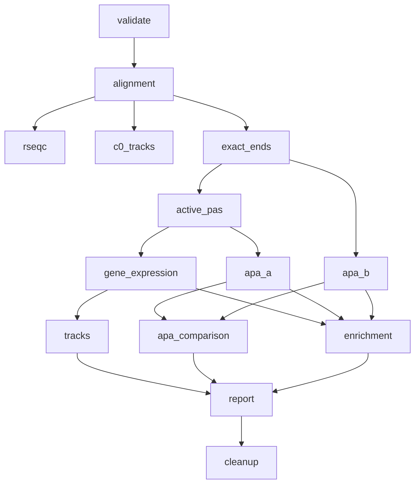

# Workflow steps and dependencies

This page describes the current executable stage order. It complements the scientific details in [methods](methods.md) and the count-universe definitions in [C0-C5 data stages](data_stages.md).

## Dependency graph



After active-PAS discovery, the DGE-then-tracks, APA-A and enabled APA-B branches may run concurrently within the validated aggregate CPU/RAM ceiling. The log can therefore show these independent branches completing in a different order from the list below; their dependencies do not change.

## Ordered stages

| Stage | Main work | Principal outputs | When skipped or disabled |
|---|---|---|---|
| `validate` | Parses `config.conf` and the samplesheet; validates references, library layouts, replicate structure, contrasts, module requirements and resource ceilings. | `00_metadata/validated_samples.tsv`, `contrasts.tsv`, `resource_plan.tsv`, resolved configuration and warnings. | Never skipped. `--stop-after validate` performs metadata/reference validation only. |
| `alignment` | Runs lane/mate FastQ Screen, raw FastQC, BBDuk trimming, STAR alignment, sorting/indexing, technical-unit merging, unique-primary C0 selection, orientation audit and MultiQC collection. | `01_qc/`, final C0 BAMs in `02_alignment/`, orientation summaries and a stage receipt. | Matching receipt and outputs permit reuse. FastQ Screen can be explicitly disabled; a missing required config fails under the production `error` policy. |
| `rseqc` | Runs `infer_experiment.py`, `read_distribution.py` and `geneBody_coverage.py` against an assembly-matched BED12 annotation. | `01_qc/rseqc/` summaries, plots and MultiQC inputs. | Disabled by `RUN_RSEQC=false`; individual RSeQC analyses have separate switches. |
| `c0_tracks` | Publishes strand-specific raw and CPM conventional aligned-read coverage from C0 aligned blocks. | Early `09_tracks/all_reads/` BigWigs/bedGraphs and normalization metadata. | Requires tracks, early-C0 publication and the all-read family. Per-sample work may already have overlapped the merge phase and is then collected rather than repeated. |
| `exact_ends` | Converts eligible C0 alignments into exact transcript-end C1 counts, separates end-defining soft-clipped C1S records, applies the internal-priming mask/rescue policy and records rejected C2R versus retained C2 ends. | `03_exact_ends/` C1, C1S, C2, C2R and audit tables. | Skipped only when no enabled analysis or track family requires exact ends. |
| `active_pas` | Pools sample-level C2 CPM condition-blind within each genome, performs the two-round Mcell2019 30-nt discovery, assigns PAS to genes and creates C3 PAS and C4 uniquely assigned gene counts. | `04_active_pas/` catalog, C3/C4 matrices, pooled signal and sample-universe signature. | Skipped only when no enabled DGE/APA-A/normalization module requires active PAS. Changing the project sample universe requires a new output directory. |
| `gene_expression` | Uses project-global C4 size factors and contrast-specific paired or unpaired DESeq2 designs; retains C5 featureCounts as a diagnostic. Produces PCA, sample-distance, MA and volcano plots. | `05_gene_expression/` result tables, contrast indexes, normalization factors and plots. | Disabled by `RUN_GENE_EXPRESSION=false`. |
| `apa_a` | Tests C3 PAS usage with DEXSeq using the Mcell2019-style catalog, derives gene-level summaries, proximal/distal shifts and candidate PCPA calls. | `06_apa_a_mcell2019/` DEXSeq tables, gene summaries, shift tables and audits. | Disabled by `RUN_APA_A_MCELL2019=false`. |
| `apa_b` | Independently clusters raw C0-equivalent endpoints with PolyAseqTrap, filters candidates with DeepIP, quantifies its own PAS catalog and tests usage with DRIMSeq/stageR. Receipt-validated C1+C1S may reconstruct the unchanged raw endpoint universe without reusing APA-A filtering. | `07_apa_b/` independent catalog/count matrix, DRIMSeq/stageR tables, NA/fit audits, gene summaries and provenance. | Enabled in the audited GRCh38/GRCm39 QuantSeq REV V2 single-end new-project template. Disabled by `RUN_APA_B=false`; any enabled run requires installation and validation manifests covering its exact protocol/assembly scope. |
| `apa_comparison` | Matches nearby independently discovered APA-A and APA-B sites and summarizes positional and effect-direction agreement. It never merges the catalogs. | `08_apa_comparison/` proximity and concordance tables. | Requires both APA methods to be enabled and successfully completed. |
| `enrichment` | Runs bounded DGE, APA-A and validated APA-B ORA/GSEA using enabled GO, Reactome, Hallmark and KEGG collections; creates database-specific plots and gene-concept networks. | Per-analysis enrichment folders plus `10_reports/enrichment_summary/`. | Disabled only when both DGE and APA enrichment are off; individual databases/plot families are configurable. |
| `tracks` | Completes enabled exact-end, filtered/rejected-end and active-PAS raw/CPM/DESeq2/robust-CPM track families, then validates their indexes. Reuses early C0 tracks. | `09_tracks/`, collection indexes and normalization tables. | Disabled by `RUN_TRACKS=false`; individual families and normalization types are configurable. |
| `report` | Recounts source tables, assembles QC and differential/APA summaries, embeds plots, writes provenance, inventories BigWigs and validates one-line UCSC descriptors. | `10_reports/report.html`, summary TSVs, provenance dashboard, BigWig list and `ucsc_track_descriptors/`. | Not executed during a dry run. Inconsistent source/index totals fail rather than producing a misleading report. |
| `cleanup` | After successful deliverable validation, removes only allow-listed dispensable intermediates and records every removal. | `provenance/cleanup/cleanup_manifest.tsv` and cleanup receipt. | Not executed during a dry run; disabled by `CLEANUP_INTERMEDIATES=false`; refuses incomplete upstream evidence. |

## Stage controls

Validate only:

```bash
rna-ends2tracks --config config/config.conf --stop-after validate
```

Plan all commands without running tools:

```bash
rna-ends2tracks --config config/config.conf --dry-run
```

Resume at a stage after correcting a failure:

```bash
rna-ends2tracks --config config/config.conf --from-step apa_b
```

Stop after a bounded part of the workflow:

```bash
rna-ends2tracks --config config/config.conf --stop-after active_pas
```

Deliberately ignore a matching receipt for one stage:

```bash
rna-ends2tracks --config config/config.conf --force-step report
```

Use `--force-step` only when the retained inputs are valid for that rerun. It does not authorize bypassing scientific validation or editing receipt files.

Legacy aliases remain accepted: `preprocess` maps to `alignment`, `early_tracks` to `c0_tracks`, `dge` to `gene_expression`, and `compare` to `apa_comparison`.

## Logs and checkpoints

- `rna_ends2tracks.log` is the chronological human-readable master log.
- `logs/` contains detailed native-tool logs and machine-readable events.
- `00_metadata/run_status.json` stores the latest workflow state used by `rna-ends2tracks status`.
- `.checkpoints/` contains content-aware receipts, timing fragments and the run lock.

Successful receipts allow safe reuse only when signatures, required outputs and audited workflow-version compatibility match. Final cleanup preserves deliverables, reports and provenance while recording removed intermediates.
