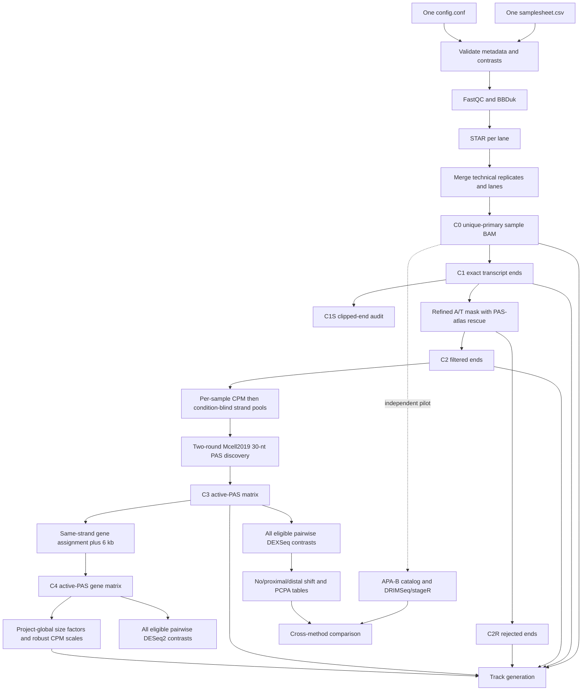

# `rna_ends2tracks` workflow revision plan

Implementation status: implemented on the clean `feature/workflow-revision` branch from the alpha.5 baseline after preserving the interrupted work on `wip/interrupted-alpha6-20260826`. This file remains the scientific and technical acceptance specification; server installation, tagging and stable promotion still require their separate validation steps.

Implemented scope includes the restricted `config.conf` interface, mixed-genome validation, bounded stage/contrast pools, C0-C5 universes, Mcell2019 discovery, C4 DGE, DEXSeq shift rules, all requested tracks/normalizations, PAS-atlas builder, side-by-side installer, run locks, receipts, success-only cleanup, Mermaid architecture and user/admin documentation.

## 1. Agreed direction

The next revision should be a practical, server-friendly QuantSeq REV V2 workflow with the same user-facing style as `ATACseq2tracks`:

- one commented `config/config.conf`;
- one `config/samplesheet.csv` containing every sample, technical replicate, and lane;
- one normal launch command;
- bounded sample-level and contrast-level parallel work controlled from `config.conf`;
- simple restartable steps;
- human GRCh38 and mouse GRCm39 support;
- no UMIs and no coordinate-based duplicate removal;
- APA method A reproducing the Mcell2019 procedure;
- an independent APA method B retained as a pilot-gated module;
- gene-expression analysis as an independent module;
- every eligible pair of biological conditions compared, with paired or unpaired designs resolved per contrast;
- raw and CPM tracks for every signal family;
- two additional normalizations for the final filtered signals: DESeq2 size-factor scaling and DESeq2 robust CPM.

The only per-project input configuration files should be:

```text
config/
├── config.conf
└── samplesheet.csv
```

Reference atlases, masks, and manifests are installed workflow assets, not additional user configuration files. Resolved settings and provenance files are generated outputs, not inputs.

Normal use should be:

```bash
rna-ends2tracks /path/to/project/config/config.conf
```

Useful controls should remain short:

```bash
rna-ends2tracks --dry-run config/config.conf
rna-ends2tracks --from-step exact_ends config/config.conf
rna-ends2tracks --stop-after alignment config/config.conf
rna-ends2tracks --force-step tracks config/config.conf
```

## 2. Evidence review and deliberate departures from the legacy scripts

The scientific specification for APA method A is the attached `method_review/APA_calling_quatification_Mcell2019.md`. The original [`3end-RNAseq-0.1`](https://github.com/MichalGd/3end-RNAseq-0.1) repository is implementation evidence, but it is not always identical to the published method.

Important findings are:

- The legacy STAR command permits up to 20 mapping loci, emits one randomly selected alignment for a multimapping read, and the PAS scripts then read those BAM records without an explicit `NH=1` filter. This is not an appropriate default for statistical PAS counts.
- The legacy PAS extraction uses the aligned reference boundary from `GRanges(GAlignments)`. It does not explicitly reject a read whose cleavage-defining end is soft-clipped.
- The legacy PAS caller resolves equal maxima with `x[score == max(score)][1]`. Because the genomic ranges are sorted, this means the lowest genomic coordinate, on both strands.
- The legacy 2024 caller thresholds per-base pooled coverage, whereas the Mcell2019 text says to sum signal in 30-nt windows before applying the `>30` threshold. The revision must follow the Mcell2019 text.
- The Mcell2019 description says the final active-PAS set was used for both APA and differential expression. A later legacy script estimates DESeq2 factors from STAR `ReadsPerGene.out.tab`. The revision should follow Mcell2019 for the primary DGE matrix and retain conventional gene counts as a diagnostic.
- Lexogen’s QuantSeq guidance uses stranded reverse counting for REV, supports single-read Read 1 analysis, and its current APA example removes low-abundance, intergenic, antisense, and overlapping-gene peaks. Lexogen also states that REV Read 1 begins at the transcript 3′ end when the custom sequencing primer is used. See the [QuantSeq REV V2 page](https://www.lexogen.com/quantseq-3mrna-sequencing-rev/), [current trimming guidance](https://faqs.lexogen.com/faq/what-sequences-should-be-trimmed-1), and [REV/FWD orientation explanation](https://faqs.lexogen.com/faq/what-are-the-differences-between-quantseq-rev-and-).

These findings lead to explicit, testable policies rather than silently reproducing legacy accidents.

## 3. Fixed read and count policies

### 3.1 Alignment eligibility

The statistical default is:

```text
mapped + primary + NH=1
```

Specifically:

- exclude unmapped, secondary, and supplementary records;
- require the STAR `NH` tag to equal 1;
- retain duplicate-flagged reads because these libraries have no UMIs and many genuine molecules share the same cleavage coordinate;
- do not deduplicate by coordinate;
- report multimapping, secondary, supplementary, duplicate-flagged, and excluded-soft-clip counts separately.

This is a deliberate improvement over the legacy PAS scripts. The legacy behavior should be available only as a named compatibility mode for method comparison, never as the statistical default.

### 3.2 End-defining soft clips

A read with soft or hard clipping at the read end that defines the QuantSeq REV cleavage coordinate is excluded from exact-end statistical universes because its exact genomic end is uncertain. It is retained in a separate audit table and optional QC track.

Clipping at the non-end-defining side does not by itself invalidate the cleavage coordinate. The implementation must derive the relevant CIGAR side from read orientation and the validated QuantSeq REV strand model; it must not assume that genomic left/right is the same as read start/end.

This is stricter than the original scripts and must be described in the methods and limitations documentation.

### 3.3 Count universes

| ID | Universe | Definition | Primary use |
|---|---|---|---|
| C0 | Eligible alignments | Unique primary alignments; duplicates retained | Aligned-read coverage and QC |
| C1 | Exact ends | One validated transcript 3′ nucleotide per C0 record | Unfiltered exact-end tracks |
| C1S | Uncertain ends | End-defining clipped records excluded from C1 | QC only |
| C2 | Filtered exact ends | C1 after the refined internal-priming mask | PAS discovery |
| C2R | Internal-priming rejects | C1 rejected by the refined mask | QC tracks and audit |
| C3 | Active-PAS counts | Raw C2 ends counted once in final non-overlapping 30-nt PAS intervals | APA and tracks |
| C4 | Active-PAS gene counts | C3 summed over unambiguously assigned PAS per gene | Primary DGE and global size factors |
| C5 | Conventional gene counts | Reverse-stranded featureCounts/STAR gene counts | Diagnostic comparison only |

Required invariants are:

```text
C0 = C1 + C1S
C1 = C2 + C2R
sum(C3) <= sum(C2)
one C2 end contributes to at most one C3 PAS
C4 contains only uniquely gene-assigned C3 counts
```

## 4. Exact Mcell2019 APA-A discovery

### 4.1 Internal-priming mask

For each supported assembly, build strand-specific genomic masks before project analysis:

1. Mask loci containing at least six consecutive A bases for transcript-plus signal, and the analogous T-rich loci for transcript-minus signal.
2. Also mask every 10-nt window containing at least seven A bases, or at least seven T bases on the opposite strand.
3. Unmask conservative 20-nt intervals around annotated GENCODE transcript ends and the approved high-confidence PAS atlas.
4. Apply the refined mask to exact C1 ends, producing C2 accepted and C2R rejected ends.

The atlas rescues plausible true PAS from an A/T-rich mask; it does not define the project’s active PAS universe.

### 4.2 Sequencing-depth correction and pooling

“Sequencing-depth corrected” is fixed as CPM per sample, followed by summation across samples separately for transcript-plus and transcript-minus signal.

For sample `i`:

```text
C2_CPM_i(position) = 1,000,000 × C2_i(position) / total_C2_i
```

`total_C2_i` is the sample’s total accepted exact ends across both transcript strands. The plus and minus profiles therefore partition one sample-level million rather than each strand receiving a separate million. The two pooled discovery profiles are:

```text
pooled_plus(position)  = sum_i C2_CPM_i_plus(position)
pooled_minus(position) = sum_i C2_CPM_i_minus(position)
```

Samples are equally weighted after library-depth correction. Pooling is project-wide, genome-specific, and condition-blind.

### 4.3 Two-round 30-nt discovery

For each strand independently:

1. Calculate the sum of pooled CPM signal in every 30-nt half-open genomic window.
2. Retain windows whose sum is strictly greater than 30.
3. Merge overlapping or directly adjacent retained windows into candidate components.
4. Within each component, locate the genomic nucleotide with the highest pooled single-nucleotide signal.
5. If several nucleotides have the same maximum, choose the lowest genomic coordinate. This reproduces the legacy sorted-`GRanges` plus `[1]` tie behavior on both strands.
6. Create a new 30-nt interval around that summit.
7. Merge overlapping new intervals and repeat the maximum/recentering operation once.
8. Sort the final intervals deterministically and verify that none overlap.

### 4.4 Exact zero-based 30-nt representation

Let the selected summit be the one-base BED interval `[p, p+1)`. Its 30-nt active-PAS interval is:

```text
[p - 14, p + 16)
```

This contains 14 bases on the lower-coordinate side, the summit base, and 15 bases on the higher-coordinate side. An even-width interval cannot be perfectly symmetric around a one-base center; this convention matches the expected `IRanges::resize(width=30, fix="center")` placement after conversion to BED coordinates. The rule is genomic and identical on both strands. Intervals are clipped at chromosome boundaries, and any clipped interval must retain its actual width in the catalog.

The catalog stores both the one-base summit and the 30-nt counting interval so browser display and quantification cannot be confused.

### 4.5 Project-wide PAS universe

Active PAS discovery is project-wide and condition-blind, separately within each genome. Adding, removing, or replacing any sample changes the input sample-set signature, creates a new PAS universe, and requires a new output directory.

If a project contains both human and mouse samples, discovery is run independently for each genome and cross-genome contrasts are forbidden.

## 5. Human and mouse PAS atlases

Build two new composite atlases following `method_review/PAS_atlas_mouse_human.md`, adjusted for the workflow’s mask-rescue role.

### 5.1 Initial workflow profiles

The first installed atlases must match the already validated server references:

| Species | Assembly | Gene annotation | Atlas ID |
|---|---|---|---|
| Human | GRCh38 | GENCODE v42 | `GRCh38_gencode_v42_pas_atlas_v1` |
| Mouse | GRCm39 | GENCODE vM31 | `GRCm39_gencode_vM31_pas_atlas_v1` |

Newer GENCODE releases must be separate reference profiles, not silent replacements. As of June 2026, GENCODE lists human v50 and mouse M39, but switching the workflow’s GTF and PAS annotation together should be a later, explicit reference-profile update ([GENCODE](https://www.gencodegenes.org/)).

### 5.2 Source hierarchy

Use:

- assembly-matched GENCODE transcript/polyadenylation ends;
- PolyA_DB v4 Main collection as the primary experimentally supported external source;
- carefully filtered PolyA_DB v4 Max and PolyASite v3 records as rescue evidence, not automatically trusted core sites.

PolyA_DB v4 contains human and mouse Max and long-read-supported Main collections; the Main collection is the more selective source and can distinguish many nested-gene assignments ([PolyA_DB v4](https://academic.oup.com/nar/article/54/D1/D247/8356008)). PolyASite v3 human is GRCh38/GENCODE 42, but its mouse catalog is GRCm38/GENCODE M25, so mouse records require audited lift-over to GRCm39 ([PolyASite v3](https://polyasite.unibas.ch/atlas_sc)).

### 5.3 Atlas tiers and use

| Tier | Content | Default use |
|---|---|---|
| Core A | GENCODE end supported by PolyA_DB v4 Main, or concordant high-confidence sources | Automatic mask rescue |
| Core B | Uniquely gene-assigned PolyA_DB v4 Main with valid strand and sequence context | Automatic mask rescue |
| Rescue C | High-stringency PolyASite or filtered PolyA_DB Max evidence | Annotation; optional expanded rescue |
| Project novel | Active sites discovered in C2 but absent from the atlas | Reported as novel; never removed solely for novelty |

The default is `PAS_MASK_RESCUE_TIER="core"`. `core_plus_rescue` is available for sensitivity analysis but should change the PAS-universe signature and output directory.

### 5.4 Build and provenance requirements

The administrator-facing atlas builder should:

- download immutable source snapshots once;
- record URLs, release names, download dates, licenses, checksums, assemblies, annotation versions, and chain-file checksum;
- convert all records to 0-based half-open BED coordinates;
- require strand preservation;
- require unique lift-over for records not already on the target assembly;
- reject split, multiply mapped, out-of-bounds, or strand-inconsistent lift-over records;
- reannotate every site against the exact target GTF;
- label multi-gene and conflicting assignments;
- generate `core.bed.gz`, `rescue.bed.gz`, `master.tsv.gz`, and a build report;
- run human and mouse synthetic rescue tests before installation.

The atlas is built once per reference profile and shared read-only. It is not downloaded or rebuilt during a user analysis.

## 6. Gene assignment, DGE, and APA interpretation

### 6.1 PAS-to-gene assignment

Extend each gene 6 kb beyond its annotated transcript-direction 3′ end. Assign a PAS only on the same transcript strand and classify its context as terminal exon, other exon, intron, downstream extension, antisense, intergenic, or ambiguous.

Intragenic exonic and intronic sites are retained. These are essential for detecting premature cleavage and polyadenylation/premature transcription termination.

PAS assigned to more than one gene are:

- retained in the active-PAS catalog and browser tracks;
- reported in a separate ambiguity table;
- excluded by default from C4 DGE and DEXSeq/DRIMSeq statistical matrices.

This agrees with Lexogen’s current APA example, which removes peaks associated with overlapping genes. Because the Mcell2019 text does not define this case, the policy must be stated prominently for later scientific review. It is configurable as `AMBIGUOUS_GENE_POLICY="exclude_statistics"`, but unsafe double assignment is not offered.

### 6.2 Primary DGE source

Use C4 active-PAS gene sums as the primary DESeq2 input. This best matches the Mcell2019 statement that active PAS were used for differential expression and preserves the molecule-counting logic of a 3′ assay.

Generate C5 featureCounts/STAR reverse-stranded gene counts as a diagnostic branch by default. Report C4-versus-C5 library correlations and genes with large discrepancies, but do not silently substitute C5 for C4.

Statistical models always use raw integer counts. CPM, DESeq2-scaled tracks, and robust CPM tracks are visualization outputs only.

### 6.3 Paired and unpaired contrasts

For each eligible within-genome pair of conditions with at least two biological replicates per condition:

- use `~ subject + condition` when the two conditions form complete biological pairs;
- use `~ condition` when their subjects are disjoint;
- fail that contrast if subjects partially overlap or pairing is incomplete, unless an explicit reviewed policy says otherwise;
- write the resolved design for every contrast before R is run.

Thus one project can contain both paired and unpaired contrasts; the design is resolved independently for each contrast.

### 6.4 Mcell2019 comparator PAS

For a gene with at least two significant PAS, select the two significant PAS with the smallest adjusted p-values. Deterministic ties are resolved by larger absolute effect, then greater contrast-wide normalized usage, then lower genomic coordinate.

If exactly one PAS is significant, define “the most frequently used other PAS” as the nonsignificant PAS with the highest mean DESeq2-normalized count across all samples in that contrast. Resolve ties by pooled raw count and then lower genomic coordinate. The comparator must have a nonzero count in at least one sample in the contrast.

This operational definition is not stated in the Mcell2019 methods or legacy repository, so it must be labeled as a workflow clarification.

### 6.5 Zero-count ratio handling

Do not add an arbitrary pseudocount to classify direction. For treated/numerator (`T`) and control/denominator (`C`) group summaries, compare distal-to-proximal ratios using the equivalent cross-product:

```text
D_T × P_C  versus  P_T × D_C
```

- greater: distal shift;
- smaller: proximal shift;
- equal: no directional change;
- both sites absent from either complete comparison: not classifiable.

For reporting, a ratio is `0` when only its numerator is zero, `Inf` when only its denominator is zero, and `NA` when both are zero. The cross-product determines direction without division-by-zero or pseudocount sensitivity.

## 7. Track families and normalization

### 7.1 Default signal families

| Family | Source | Raw | CPM | DESeq2 | Robust CPM |
|---|---|---:|---:|---:|---:|
| All aligned-read coverage | C0 alignment blocks | yes | yes | no | no |
| Exact transcript ends | C1 one-base ends | yes | yes | no | no |
| Filtered exact ends | C2 one-base ends | yes | yes | yes | yes |
| Internal-priming rejects | C2R one-base ends | yes | yes | no | no |
| Active PAS | C3 count at summit plus 30-nt BED catalog | yes | yes | yes | yes |

All five families are generated by default and can be disabled independently in `config.conf`. BigWig is the default format; bedGraph retention is independently configurable.

Write transcript-plus and transcript-minus tracks separately. Minus-strand browser tracks use negative values for display, while matrices and normalization denominators remain unsigned.

### 7.2 CPM

Every track family receives CPM normalization. For sample `i` and family `F`:

```text
CPM scale_i,F = 1,000,000 / N_i,F
```

The denominator is the number of eligible sample observations for that family across both strands:

- C0 for all-read coverage;
- C1 for exact ends;
- C2 for filtered ends;
- C1 for the rejected-end QC track, so its height preserves the rejection fraction rather than forcing rejected signal to total one million;
- assigned C3 counts for active-PAS tracks.

The denominator, count universe, and applied scale are written to `track_normalization.tsv`.

### 7.3 DESeq2 size-factor tracks

Estimate one project-global size-factor vector from the complete C4 matrix, independently for each genome. Use DESeq2’s sparse-count-compatible `poscounts` estimator unless validation supports the default ratio estimator.

```text
DESeq2 track scale_i = 1 / size_factor_i
```

Apply this vector to C2 filtered-end and C3 active-PAS tracks only. Pairwise analyses may estimate subset-specific factors for testing, but those factors never alter browser tracks.

### 7.4 DESeq2 robust CPM

Match the implementation and explanation in `ATACseq2tracks` and verify numerically against `DESeq2::fpm(dds, robust=TRUE)`.

Let:

```text
G = exp(mean(log(colSums(C4))))
robust effective library_i = size_factor_i × G
robust CPM scale_i = 1,000,000 / (size_factor_i × G)
```

Apply this scale to the same final C2 and C3 track families. Robust CPM has CPM-like units while preserving DESeq2 relative sample scaling. It is a visualization normalization, not input to DGE or APA tests.

### 7.5 Track controls in `config.conf`

```bash
GENERATE_ALL_READ_TRACKS=true
GENERATE_EXACT_END_TRACKS=true
GENERATE_FILTERED_END_TRACKS=true
GENERATE_REJECTED_END_TRACKS=true
GENERATE_ACTIVE_PAS_TRACKS=true

GENERATE_RAW_TRACKS=true
GENERATE_CPM_TRACKS=true
GENERATE_DESEQ2_FINAL_TRACKS=true
GENERATE_DESEQ2_ROBUST_CPM_FINAL_TRACKS=true

GENERATE_BIGWIGS=true
KEEP_BEDGRAPHS=false
```

Invalid combinations fail during preflight; for example, DESeq2 track switches require C4 generation.

## 8. Data-flow architecture



The workflow must keep APA-A, APA-B, and DGE as independent modules that share validated preprocessing but have separate results, status, and failure reporting.

## 9. `config.conf` and samplesheet contract

### 9.1 Configuration syntax

Use ATACseq2tracks-style uppercase `KEY=value` syntax. For safety and predictable validation, parse a restricted shell-assignment grammar; do not `source` arbitrary commands, execute substitutions, or use `eval`.

The shipped file is both template and reference: each setting has a short comment, unit, allowed values, and default. There should not be a second user configuration file or a competing YAML schema.

Suggested organization:

```bash
# Project
PROJECT_ID="mesc_degron_run8"
SAMPLESHEET="/path/to/project/config/samplesheet.csv"
OUTPUT_DIR="/path/to/project/results"
TMP_DIR="/path/to/project/tmp"

# Modules
RUN_GENE_EXPRESSION=true
RUN_APA_A_MCELL2019=true
RUN_APA_B=false
RUN_TRACKS=true

# QuantSeq REV V2, no UMI
LIBRARY_PROTOCOL="quantseq_rev_v2"
LIBRARY_LAYOUT="single_end"
UMI_PRESENT=false
MAPPING_POLICY="unique_primary"
END_SOFT_CLIP_POLICY="exclude_and_report"

# References; genome is selected per samplesheet row
HG38_STAR_INDEX="/path/to/GRCh38_STAR"
HG38_FASTA="/path/to/GRCh38.fa"
HG38_GTF="/path/to/gencode.v42.gtf"
HG38_CHROM_SIZES="/path/to/GRCh38.chrom.sizes"
HG38_PAS_ATLAS="/shared/GRCh38_gencode_v42_pas_atlas_v1"
MM39_STAR_INDEX="/path/to/GRCm39_STAR"
MM39_FASTA="/path/to/GRCm39.fa"
MM39_GTF="/path/to/gencode.vM31.gtf"
MM39_CHROM_SIZES="/path/to/GRCm39.chrom.sizes"
MM39_PAS_ATLAS="/shared/GRCm39_gencode_vM31_pas_atlas_v1"

# Statistics
MIN_REPLICATES_PER_CONDITION=2
PAIRING_MODE="auto"
PAIRING_COLUMN="subject"
INCOMPLETE_PAIR_ACTION="error"
AMBIGUOUS_GENE_POLICY="exclude_statistics"

# Mcell2019 fixed defaults
INTERNAL_PRIMING_CONSECUTIVE_BASES=6
INTERNAL_PRIMING_WINDOW_NT=10
INTERNAL_PRIMING_MIN_BASES_IN_WINDOW=7
PAS_MASK_RESCUE_TIER="core"
PAS_DISCOVERY_WINDOW_NT=30
PAS_DISCOVERY_THRESHOLD=30
PAS_DISCOVERY_THRESHOLD_OPERATOR="greater_than"
PAS_DISCOVERY_ROUNDS=2
GENE_DOWNSTREAM_EXTENSION_NT=6000

# Parallel execution
MAX_TOTAL_THREADS=48
PREPROCESS_PARALLEL_JOBS=4
FASTQC_THREADS=4
BBDUK_THREADS=8
STAR_PARALLEL_JOBS=4
STAR_THREADS=12
SAMTOOLS_THREADS=6
END_EXTRACTION_PARALLEL_JOBS=6
TRACK_PARALLEL_JOBS=4
TRACK_THREADS=4
DGE_CONTRAST_PARALLEL_JOBS=2
APA_CONTRAST_PARALLEL_JOBS=2

# Output and restart
CLEANUP_INTERMEDIATES=true
KEEP_TRIMMED_FASTQ=false
KEEP_LANE_BAMS=false
KEEP_APA_SAMPLE_EXTRACTION=false
KEEP_TRACK_STRAND_BAMS=false
KEEP_BEDGRAPHS=false
```

Scientific constants needed for faithful `mcell2019` mode remain visible, but changing them should mark the run as a modified method in the report.

### 9.2 Samplesheet

Keep one row per FASTQ-producing lane or technical library:

```text
sample_id,description,genome,biological_replicate_id,technical_replicate_id,lane_id,fastq_r1,fastq_r2,condition,batch,subject,library_protocol,library_layout,read_length,kit_catalog,umi_present
```

Rules:

- `genome` accepts explicit supported values such as `GRCh38` or `GRCm39`;
- `sample_id` is the biological analysis unit;
- rows sharing a sample are technical replicates/lanes and merge before statistics;
- biological metadata must be invariant within a sample;
- `fastq_r2` is empty for the supported single-end QuantSeq REV path;
- `umi_present` must be false for the current workflow scope;
- optional biological columns such as `cell_type`, `treatment`, `donor`, `sex`, and `genotype` are allowed;
- cross-genome comparisons are rejected;
- configuration parameters and thread counts never belong in the samplesheet.

## 10. Parallel work without excessive machinery

Parallelism should follow the ATACseq2tracks model: ordinary bounded background-job pools, deterministic input order, and explicit per-tool thread counts.

For the 144-core/503-GiB server, the default 48-thread cap is intentionally conservative enough for coexistence but still uses the server effectively:

| Stage | Jobs | Threads/job | Maximum threads |
|---|---:|---:|---:|
| FastQC/BBDuk | 4 | up to 8 | 32 |
| STAR | 4 | 12 | 48 |
| samtools merge/sort | 4 | 6 | 24 |
| Exact-end/filter extraction | 6 | 1 | 6 |
| Track generation | 4 | 4 | 16 |
| DGE contrasts | 2 | 1 plus R library threads | bounded at 2 processes |
| APA contrasts | 2 | 1 plus R library threads | bounded at 2 processes |

Preflight validates that `jobs × threads` does not exceed `MAX_TOTAL_THREADS`. Memory settings may be used where the tool genuinely enforces them, such as the BBDuk Java heap and samtools sort buffer. The first revision does not need cgroups, scheduler integration, or a complicated pseudo-enforced global memory model; it should print a resource summary and warn about obviously unsafe combinations.

A failed worker stops the next stage after already-running siblings finish. Results are assembled in samplesheet/contrast order, not completion order.

## 11. Simple checkpoints and recovery

Use numbered workflow steps:

```text
00 validate
01 qc_trim
02 alignment
03 sample_merge
04 exact_ends_and_mask
05 active_pas_discovery
06 quantification_and_normalization
07 tracks
08 statistics
09 report
10 success_only_cleanup
```

Each expensive per-lane, per-sample, or per-contrast unit writes a small success marker only after its expected outputs pass native validation. Each stage writes one completion marker after all units succeed.

The marker needs only:

- workflow version;
- step and unit ID;
- relevant config/sample/reference signature;
- declared outputs;
- completion time.

This is sufficient for safe resume without hashing every large BAM or building a complex workflow engine. A single run lock prevents two writers from using the same output directory. Temporary outputs are created on the same filesystem and renamed only after validation.

### Default-on cleanup contract

`CLEANUP_INTERMEDIATES=true` is the default. Cleanup starts only after every enabled analysis module and the final report have successful receipts. A failed or interrupted run retains its intermediates for diagnosis and resume.

The default cleanup removes:

- BBDuk-trimmed FASTQs after final sample BAMs and downstream modules succeed;
- lane-level sorted BAMs and raw STAR alignment BAMs after the merged biological-sample BAMs are validated;
- per-sample APA extraction fragments after they are consolidated into project-wide exact-end outputs;
- strand-split BAMs made only for track generation;
- temporary bedGraphs after their BigWigs are validated.

It always preserves:

- final biological-sample BAMs and indexes;
- raw and trimmed FastQC/MultiQC results and STAR/QC summaries;
- exact-end and internal-priming audit tables;
- PAS catalogs and raw count matrices;
- DGE and APA results;
- final BigWigs, reports, logs, checkpoints, and provenance.

Every removed path, category, byte count, and timestamp is written to `provenance/cleanup/cleanup_manifest.tsv`. Cleanup operates on an explicit allow-list of files below the resolved results directory; it must never recursively remove the results tree. The `KEEP_*` switches allow troubleshooting retention, and a standalone cleanup command can safely retry cleanup after a completed run.

## 12. Output structure

```text
results/
├── 00_metadata/                 validated samples, contrasts, resolved config, resource plan
├── 01_qc/                       FastQC, MultiQC, trimming and orientation summaries
├── 02_alignment/                final sample BAMs and STAR summaries
├── 03_exact_ends/               C1, C1S, C2, C2R and audits
├── 04_active_pas/               pooled CPM, iterations, catalog and C3 matrix
├── 05_gene_expression/          C4 primary DGE and C5 diagnostic comparison
├── 06_apa_a_mcell2019/          DEXSeq, shifts and PCPA results
├── 07_apa_b/                    independent pilot outputs
├── 08_apa_comparison/           cross-method concordance
├── 09_tracks/                   family subdirectories and normalization table
├── 10_reports/                  HTML/TSV summaries, IGV and UCSC assets
├── logs/
└── .checkpoints/
```

`00_metadata/resolved_config.tsv` is generated from `config.conf`; it is not another configuration input.

## 13. Implementation plan

### Phase 0 — preserve and simplify

1. Preserve the interrupted alpha.6 diff on a WIP branch.
2. Return implementation work to the alpha.5 release baseline.
3. Reuse only tested pieces of the interrupted bounded-worker code.
4. Do not change the installed alpha.5 launcher during development.

### Phase 1 — user interface and execution

1. Add the strict `config.conf` parser and remove YAML from the normal run contract.
2. Convert the current example into one fully commented `config.conf` and one samplesheet.
3. Add the single-command launcher and short dry-run/restart options.
4. Add bounded lane, sample, track, and contrast pools.
5. Add simple per-unit/stage completion markers and a run lock.

Stop gate: an 18-sample dry run resolves references, technical merges, 3 paired contrasts, 12 unpaired contrasts, commands, and maximum concurrency correctly.

### Phase 2 — references and Mcell2019 core

1. Implement and test exact QuantSeq REV end coordinates and end-defining clip detection.
2. Build the two versioned PAS atlases and A/T masks.
3. Implement C0–C2R extraction and audit tables.
4. Implement true CPM pooling and the exact two-round 30-nt algorithm.
5. Generate the active-PAS catalog and C3 matrix.

Stop gate: synthetic plus/minus truth sets and human/mouse real-read canaries reproduce all coordinate, mask, tie, threshold, and non-overlap rules.

### Phase 3 — DGE, APA, and tracks

1. Implement strand-aware 6-kb gene extension and unique assignment.
2. Generate C4 primary and C5 diagnostic matrices.
3. Implement pairwise DESeq2 and DEXSeq with contrast-specific paired/unpaired designs.
4. Implement comparator selection and zero-safe shift direction.
5. Generate all raw/CPM tracks plus final-signal DESeq2 and robust-CPM tracks.
6. Keep APA-B independent and disabled by default until its pilot validation passes.

Stop gate: known-effect statistical fixtures and normalization equivalence tests pass.

### Phase 4 — documentation, automated installation, and release

1. Put the workflow Mermaid diagram and quick start in `README.md`.
2. Document methods, coordinate conventions, atlas provenance, track meanings, outputs, limitations, and troubleshooting.
3. Make `config/config.conf` the single configuration reference through inline comments.
4. Add one installer that creates a side-by-side environment, installs workflow assets, runs automated smoke tests, and creates the versioned launcher.
5. Run human and mouse real-read canaries, then tag and promote only after review.

## 14. Required tests

Scientific unit tests:

- plus/minus REV exact-end coordinates across CIGAR operations;
- end-defining and non-end-defining soft/hard clips;
- unique primary, multimapping, secondary, supplementary, and duplicate policies;
- six-consecutive and seven-of-ten A/T masks;
- core and optional rescue-atlas unmasking;
- `[p-14,p+16)` boundary behavior;
- true 30-nt window sums and strict `>30` threshold;
- lowest-coordinate equal-maximum tie behavior on both strands;
- two-round overlap resolution;
- one-end/one-PAS conservation;
- 6-kb plus/minus extension and intragenic PCPA categories;
- ambiguous-gene exclusion;
- comparator PAS selection and zero-safe ratio classification;
- C3-to-C4 gene sums;
- DESeq2 robust CPM equivalence to `fpm(..., robust=TRUE)`.

Integration tests:

- multiple lanes and technical libraries merge into one biological sample;
- mixed paired and unpaired contrasts resolve automatically;
- mixed human/mouse projects separate their universes and reject cross-genome contrasts;
- sequential and parallel runs produce identical catalogs and matrices;
- an interrupted sample or contrast resumes without rerunning successful units;
- changed sample membership refuses reuse of an old PAS universe;
- track switches affect only track/report steps;
- clean-shell execution works for another server user.

## 15. Documentation set

Keep documentation useful but compact:

```text
README.md                         quick start, flowchart, principal outputs
config/config.conf               complete commented configuration reference
docs/methods.md                  preprocessing, C0–C5, Mcell2019, DGE and APA-B
docs/pas_atlases.md              human/mouse builds and provenance
docs/tracks_and_outputs.md       every track, scale, filename and output table
docs/server_installation.md      one install/update/rollback procedure
docs/recovery_and_troubleshooting.md
docs/limitations.md              soft clips, ambiguity, atlas rescue, PCPA interpretation
```

Avoid duplicated configuration guides. Documentation must state clearly that:

- exact-end, filtered-end, and active-PAS tracks are different objects;
- raw counts, CPM, DESeq2 scaling, and robust CPM have different units and uses;
- all statistics use raw integer counts;
- ambiguous multi-gene PAS are present in catalogs/tracks but excluded from default statistics;
- active PAS discovery is condition-blind and depends on the complete project sample set;
- intragenic PAS are retained and can represent premature transcription termination;
- APA-B remains independently pilot-gated.

## 16. Installation and release approach

Implementation and installation should be less manual than the alpha releases:

- one versioned Conda/Mamba environment;
- one versioned workflow launcher;
- shared read-only reference assets and PAS atlases;
- one automated install script with preflight, environment creation, package installation, smoke test, and receipt;
- side-by-side installation so the stable alpha.5 remains usable until promotion;
- one atomic stable-link change for promotion and one command for rollback.

The automated release gate should be proportionate:

1. source tests and config validation;
2. environment solve/install;
3. human and mouse scientific canaries;
4. parallel/restart smoke test;
5. shared-user clean-shell test;
6. deployment receipt and rollback target;
7. explicit stable promotion.

Do not require a long sequence of manual audit commands when the installer can perform and record them itself.

## 17. Resolution of the former approval list

| Former question | Resolution |
|---|---|
| Sequencing-depth correction | Per-sample CPM, then project-wide condition-blind summation separately by strand |
| Even-width 30-nt coordinates | Summit `[p,p+1)` becomes `[p-14,p+16)`; document the unavoidable one-base asymmetry |
| Equal maxima | Lowest genomic coordinate on both strands, matching the legacy sorted-range first-hit rule |
| Mouse and human rescue sites | Build new assembly/annotation-matched composite atlases for both species |
| Mapping policy | Unique primary (`NH=1`), duplicates retained |
| End-defining soft clips | Exclude from statistical ends and report separately |
| Ambiguous multi-gene PAS | Keep in catalog/tracks; exclude from C4 and APA statistics by default |
| “Most frequently used other PAS” | Highest contrast-wide mean DESeq2-normalized usage among nonsignificant alternatives |
| Zero counts in ratios | No pseudocount; classify by cross-product and report `0`, `Inf`, or `NA` explicitly |
| Primary DGE | C4 active-PAS gene sums; C5 conventional counts diagnostic only |
| Configuration syntax | `config.conf`, not YAML; one samplesheet and no other user config input |
| Track size factors | Project-global, genome-specific C4 factors approved |
| Reference versions | Initial profiles match installed GENCODE v42/GRCh38 and vM31/GRCm39; source snapshots fully versioned |
| PAS universe | Project-wide, genome-specific, condition-blind; changed sample membership requires a new output directory |

No additional user decision is required before beginning Phase 0 and Phase 1. The comparator and ambiguous-gene rules are documented workflow clarifications because the published method does not define them; they should remain visible in result provenance and can be reviewed after the first scientific canary.
